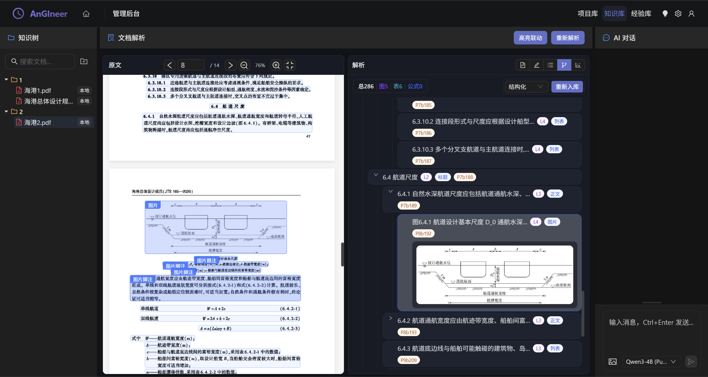

# 🏗️ AnGIneer: 工程领域的AI工程师

**AnGIneer** (AGI + Engineer) 是专为严谨工程领域打造的AI操作Agent系统。它将小型语言模型 (SLM)、标准作业程序 (SOPs)、工程工具链 (EngTools) 与地理信息世界 (GeoWorld) 深度融合，致力于为工程师提供**过程可控、结果精确、具备环境感知能力**的自动化解决方案。

> *"Human Defines SOP, AnGIneer Executes with Precision."*

---

## 1. 核心理念

- **确定性优先 (Deterministic First)**: 在工程领域，"准确"优于"创造"。AnGIneer 通过严格遵循 SOP，杜绝 LLM 的幻觉风险。
- **混合智能 (Hybrid Intelligence)**: **Code** 负责严谨逻辑与计算，**LLM** 负责意图理解、非结构化数据解析与人机交互。
- **环境感知 (Context Aware)**: 打通数字世界与物理世界（GeoWorld），让计算不再是真空中的数学题，而是基于真实地理环境的工程决策。

---

## 2. 核心架构

AnGIneer 不仅仅是一个 Agent，更是一套连接知识、工具与物理世界的工业级 OS。系统采用 **Monorepo (单体仓库)** 架构：

```
┌─────────────────────────────────────────────────────────────┐
│                         用户界面层                             │
│  ┌──────────────────────────────────────────────────────┐  │
│  │  apps/web-console/ (Vue 3 + Ant Design Vue)  端口3005 │  │
│  │  apps/admin-console/ (Vue 3 + Ant Design Vue) 端口3002│  │
│  └──────────────────────────────────────────────────────┘  │
└────────────────────────────┬────────────────────────────────┘
                             │ HTTP API
┌────────────────────────────▼────────────────────────────────┐
│                      API 网关层 (FastAPI)                     │
│                    apps/api-server/main.py  端口8033          │
└────────────────────────────┬────────────────────────────────┘
                             │
┌────────────────────────────▼────────────────────────────────┐
│                      后端核心服务层                            │
│  angineer-core | sop-core | docs-core | geo-core | engtools   │
└─────────────────────────────────────────────────────────────┘
```

### 2.1 子系统矩阵

| 子系统 | 对应服务 | 核心职责 |
|:---|:---|:---|
| **AnGIneer-SOP** | `services/sop-core` | **流程大脑**。负责 SOP 的定义、解析与可视化编排。 |
| **AnGIneer-Tools** | `services/engtools` | **专业工具**。高精度工程计算器、脚本库与交互界面。 |
| **AnGIneer-Docs** | `services/docs-core` | **行业记忆**。基于AnGIneer数据标准的规范自动解析与知识库管理。 |
| **AnGIneer-Geo** | `services/geo-core` | **世界底座**。集成 GIS 数据、水文气象信息与地图展示。 |

### 2.2 前端资源架构（当前）

```text
ResourceAdapter(project/knowledge/sop)
  -> OpenResourcePayload
  -> openResource
  -> web-console Workbench Tabs

admin-console 与 web-console 共享同一套 SmartTree / AIChat / 资源适配协议
```

### 2.3 文档解析与对比查改架构（当前规划）



```text
Admin B区（文档生命周期）
  -> 未解析（原文预览 + 解析 + 共享）
  -> 解析中（任务进度可视化）
  -> 已解析（B1原文 + B2 Markdown可编辑）
  -> 结构化主链（A_structured）
```

```text
docs-core 后端实现
  -> parser: 对接 MinerU，输出原始解析结果目录
  -> structured: 完成结构化构建、索引落盘与文档存储
  -> knowledge_service.py: 提供知识库元数据与索引服务门面
```

```text
存储规范（One Doc One Folder）
data/knowledge_base/libraries/{library_id}/documents/{doc_id}/
  source/ + parsed(content.md / mineru_raw / doc_blocks_graph.json) + edited/ + structured/
  (版本化: 基于 SCHEMA_VERSION 追踪解析产物结构一致性)
```

```text
数据库拆分（docs-core）
  -> knowledge_meta.sqlite: libraries / nodes / parse_tasks / artifacts / revisions
  -> knowledge_index.sqlite: doc_blocks / document_segments
  -> 仅保留双库：运行时与离线流程统一使用上述两库
```

---

## 3. 快速开始

### 3.1 环境准备

```bash
git clone https://github.com/YourOrg/AnGIneer.git
cd AnGIneer
```

### 3.2 安装依赖

```bash
# 安装前端依赖
pnpm install

# 安装后端依赖
pip install -e services/angineer-core -e services/sop-core -e services/docs-core -e services/geo-core -e services/engtools
```

### 3.3 启动服务

```bash
pnpm dev
pnpm dev:frontend
pnpm dev:admin
pnpm dev:backend
```

### 3.4 运行测试

```bash
pnpm harness
pnpm harness:workflow
pnpm harness:tooling
```

---

## 4. 开发路线图

| 阶段 | 版本 | 目标 |
|:---|:---|:---|
| **内核构建** | v0.1 | 调度器、意图识别、SOP解析、记忆总线、工具引擎 |
| **知识与视觉** | v0.2 | 文档解析、PDF 高级渲染优化（防闪烁/自适应）、图表语义化、经验库构建 |
| **交互与编排** | v0.3 | Web控制台、流程编辑器、人机协作 |

---

## 5. 文档

前端架构图、可开工改造清单请查看 [apps/Techniques.md](./apps/Techniques.md)

后端架构图、数据与策略实现请查看 [services/Techniques.md](./services/Techniques.md)

---

*AnGIneer - Re-engineering the Future of Engineering.*
