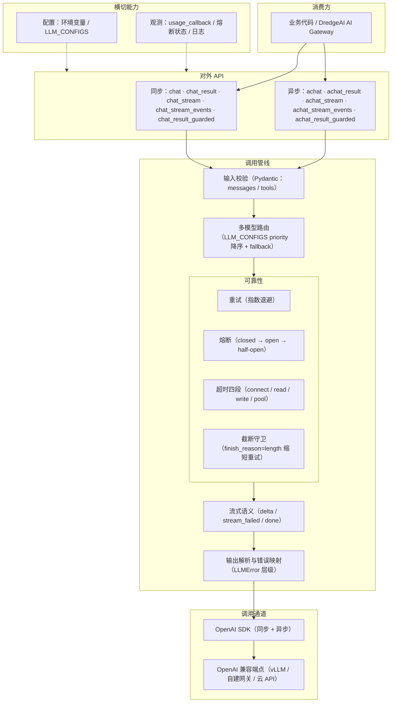

# angineer-ai-inference

[](https://pypi.org/project/angineer-ai-inference/)

AnGIneer 的 AI 推理客户端库（纯 Python 库，非服务）：负责 **LLM 多模型路由、调用、可靠性、解析**。

> 定位：**本库不包含 HTTP 服务**，不依赖 fastapi / uvicorn。对外 API Key、权限、限额、调用记录与用量持久化、管理后台均属于消费方（如 DredgeAI AI Gateway）的职责。

## 功能架构

一次调用完整走通「校验 → 路由 → 可靠性 → 流式 → 解析」管线，配置与观测横切整个调用过程：


```mermaid
flowchart TB
    subgraph consumer["消费方"]
        app["业务代码 / DredgeAI AI Gateway"]
    end

    subgraph api["对外 API"]
        sync["同步：chat · chat_result · chat_stream · chat_stream_events · chat_result_guarded"]
        async["异步：achat · achat_result · achat_stream · achat_stream_events · achat_result_guarded"]
    end

    subgraph pipeline["调用管线"]
        validate["输入校验（Pydantic：messages / tools）"]
        route["多模型路由（LLM_CONFIGS priority 降序 + fallback）"]
        subgraph reliability["可靠性"]
            retry["重试（指数退避）"]
            cb["熔断（closed → open → half-open）"]
            timeout["超时四段（connect / read / write / pool）"]
            guard["截断守卫（finish_reason=length 缩短重试）"]
        end
        stream["流式语义（delta / stream_failed / done）"]
        parse["输出解析与错误映射（LLMError 层级）"]
    end

    subgraph channel["调用通道"]
        sdk["OpenAI SDK（同步 + 异步）"]
        endpoint["OpenAI 兼容端点（vLLM / 自建网关 / 云 API）"]
    end

    subgraph cross["横切能力"]
        cfg["配置：环境变量 / LLM_CONFIGS"]
        obs["观测：usage_callback / 熔断状态 / 日志"]
    end

    app --> sync & async
    sync & async --> validate
    validate --> route
    route --> reliability
    reliability --> stream
    stream --> parse
    parse --> sdk
    sdk --> endpoint
    cfg -.-> api
    obs -.-> api
```

## 安装

```bash
# PyPI（推荐）
pip install angineer-ai-inference

# 或从 GitHub 钉版本安装
pip install "angineer-ai-inference @ git+https://github.com/0mao0/angineer-ai-inference.git@v0.1.1"

# 本地开发（主仓库 AnGIneer 内）
pip install -e services/ai-inference
```

Python 要求 `>=3.10`；依赖：`openai>=1.0,<2.0`、`pydantic>=2.0,<3.0`、`python-dotenv>=1.0`、`httpx>=0.24`。

## 快速开始

```python
from ai_inference import get_llm_client, chat_result_guarded

client = get_llm_client()

# 纯文本（多模型 fallback、重试、熔断自动生效）
text = client.chat([{"role": "user", "content": "你好"}])

# 完整结果（含 usage / finish_reason / 元数据）
result = client.chat_result(
    [{"role": "user", "content": "请用 JSON 返回"}],
    mode="thinking",
)

# 流式
for delta in client.chat_stream([{"role": "user", "content": "讲个故事"}]):
    print(delta, end="", flush=True)

# 截断守卫：finish_reason=length 时自动缩短输入重试一次，仍截断抛 LLMTruncatedError
result = chat_result_guarded(client, [{"role": "user", "content": "..."}])
```

## 配置

配置全部来自环境变量；模型列表来自 `LLM_CONFIGS`（JSON 数组，按 `priority` 降序作为 fallback 顺序）。

### LLM_CONFIGS 字段

```json
[
  {
    "name": "Qwen3.6-A3B",
    "model": "Qwen3.6-35B-A3B-FP8",
    "api_key": "sk-...",
    "base_url": "https://your-gateway/v1",
    "enabled": true,
    "priority": 10
  }
]
```

| 字段 | 说明 |
| :--- | :--- |
| `name` | 配置名（路由/熔断/元数据以它标识） |
| `model` | 传给 OpenAI 兼容端点的模型名（可作为别名匹配配置） |
| `api_key` | API Key |
| `base_url` | OpenAI 兼容端点地址；会自动去掉多余的 `/chat/completions` 后缀 |
| `enabled` | 是否参与路由 |
| `priority` | 越大越优先；仅显式指定 `config_name`/`model` 时才会严格钉住单个配置，否则按 priority 排序并支持 fallback |

### ANGINEER_* 环境变量

| 变量 | 默认 | 说明 |
| :--- | :--- | :--- |
| `ANGINEER_DEFAULT_MODEL` | 空 | 默认模型配置名；**只做优先排序，不钉死**（挂了会 fallback 到其他配置） |
| `ANGINEER_TIMEOUT_CONNECT` | 10 | 连接超时（秒） |
| `ANGINEER_TIMEOUT_READ` | 60 | 读取超时（秒） |
| `ANGINEER_TIMEOUT_WRITE` | 60 | 写入超时（秒） |
| `ANGINEER_TIMEOUT_POOL` | 10 | 连接池等待超时（秒） |
| `ANGINEER_TIMEOUT_TOTAL` | 120 | 整体超时（秒） |
| `ANGINEER_MAX_RETRIES` | 3 | 单 provider 重试次数（超时/断连/限流） |
| `ANGINEER_RETRY_INITIAL_DELAY` | 1.0 | 首次重试延迟（秒） |
| `ANGINEER_RETRY_MAX_DELAY` | 30 | 重试延迟上限（秒） |
| `ANGINEER_RETRY_EXPONENTIAL_BASE` | 2.0 | 退避底数 |
| `ANGINEER_CB_FAILURE_THRESHOLD` | 5 | 连续失败多少打开熔断器 |
| `ANGINEER_CB_RECOVERY_TIMEOUT` | 60 | 打开后多久进入半开（秒） |
| `ANGINEER_CB_HALF_OPEN_REQUESTS` | 1 | 半开允许的探测请求数 |
| `ANGINEER_TEMPERATURE` | 0.1 | 默认采样温度 |
| `ANGINEER_MAX_TOKENS` | 16384 | 默认 max_tokens |
| `FORCE_LLM_MODE` | 空 | 强制模式（`instruct` / `thinking`），覆盖每次调用 |
| `ANGINEER_LOG_LEVEL` | INFO | 日志级别 |

超时四段（connect/read/write/pool）通过 `httpx.Timeout` 完整传给 OpenAI SDK，不只是 total。

## 模式与 tools

- `instruct`：无 system 消息时自动补一条专业助手 system 提示；
- `thinking`：追加"深度思考并用 `<thought>` 标签包裹"的系统提示；
- 两个模式都不会修改调用方传入的 `messages`（内部浅拷贝）；
- `tools` 透传 OpenAI 兼容格式；`messages` / `tools` 会先做 Pydantic 结构校验，非法输入立即抛 `ValueError`。

## 流式语义（已固化）

- **首个 delta 产出之前失败** → 按重试/熔断规则切换到下一个 Provider；
- **已经产出 delta 之后失败** → `chat_stream_events` 产出 `stream_failed` 事件（含 `text`（部分内容）、`error.type`、`error.message`、元数据）并立即停止，不再切换 Provider；`chat_stream` 抛 `LLMStreamError`（携带 `partial_text`），由调用方决定保留还是丢弃重发；
- **正常结束** → 产出 `done` 事件，含 `finish_reason`、`usage` 与元数据（`used_config` / `used_model` / `attempts` / `latency_seconds` / `circuit_breaker_state`）。

```python
for event in client.chat_stream_events([{"role": "user", "content": "..."}]):
    if event["type"] == "delta":
        print(event["text"], end="", flush=True)
    elif event["type"] == "stream_failed":
        print(f"\n[中断] {event['error']['message']}，已输出: {event['text']!r}")
        break
    elif event["type"] == "done":
        print(f"\n[完成] usage={event['usage']} used_config={event['used_config']}")
```

## 重试与熔断

- 重试仅针对可恢复错误：`APITimeoutError` / `APIConnectionError` / `RateLimitError`，指数退避；
- 每模型独立熔断器：closed →（连续失败达阈值）→ open →（恢复时间后）→ half-open →（成功次数达标）→ closed；半开失败立即回到 open；
- 熔断状态可观测：`get_circuit_breaker_status()` 返回 `state`、`failure_count`、`success_count`、`half_open_success_count`、`total_calls`、`last_failure_time`、`last_error_message`、`last_success_time`；可用 `reset_circuit_breaker(config_name)` 重置。

## 错误层级

统一从 `ai_inference.errors` 导入，全部继承 `LLMError`：

| 异常 | 含义 |
| :--- | :--- |
| `ProviderUnavailableError` | 连接失败 / 读取超时 / 5xx |
| `ProviderAuthError` | API Key 无效等鉴权失败 |
| `RateLimitedError` | 限流（429） |
| `LLMTruncatedError` | 输出被 max_tokens 截断（截断守卫） |
| `LLMStreamError` | 流式中途失败（携带 `partial_text`） |
| `AllProvidersFailedError` | **多 Provider** 全部失败（`last_error` / `errors` 可拿到细节） |

单个 Provider 失败时直接抛出精确错误（如 `RateLimitedError`）；多个 Provider 全部失败才抛 `AllProvidersFailedError`。`ParseError` 也继承 `LLMError`。

## 结果元数据与用量回调

`ChatResult` 除 `text` / `finish_reason` / `usage` / `tool_calls` 外，还包含：

`latency_seconds`（本次调用耗时）、`attempts`（含重试与 fallback 的总请求次数）、`used_config`、`used_model`、`circuit_breaker_state`。

用量回调（**不落库**，由调用方决定持久化）：

```python
client = LLMClient(config, usage_callback=lambda r: metrics.record(r.usage, r.used_config))
```

流式请求在 `done` 时回调（携带完整文本与 usage）；回调抛错只记 warning，不影响请求结果。

## 异步 API

同步与异步共享同一套配置、熔断器与错误语义：

```python
result = await client.achat_result([{"role": "user", "content": "hi"}])
async for text in client.achat_stream([{"role": "user", "content": "hi"}]):
    ...
```

异步版：`achat` / `achat_result` / `achat_stream` / `achat_stream_events` / `achat_result_guarded`。

## 线程安全

- `get_llm_client()` 单例初始化有锁保护，多线程并发首次调用安全；
- 同一 `LLMClient` 实例可被多线程并发调用（熔断器内部有锁）；
- `AsyncOpenAI` 按 event loop 使用：同一个 `LLMClient` 的 `achat_*` 请在同一事件循环内并发调用，不要跨事件循环共享。

## 不在本库范围

- HTTP 服务（FastAPI / uvicorn 入口）——由消费方网关实现；
- 对外 API Key / 权限 / 限额管理；
- 调用记录与用量持久化/聚合（通过 `usage_callback` 交给调用方）；
- 管理后台。

## 开发与测试

```bash
python -m unittest discover -s tests
```

测试覆盖：配置解析、超时四段、重试退避、熔断状态机、流式语义、截断守卫、JSON 解析、错误分类、异步与并发、线程安全、输入校验。
