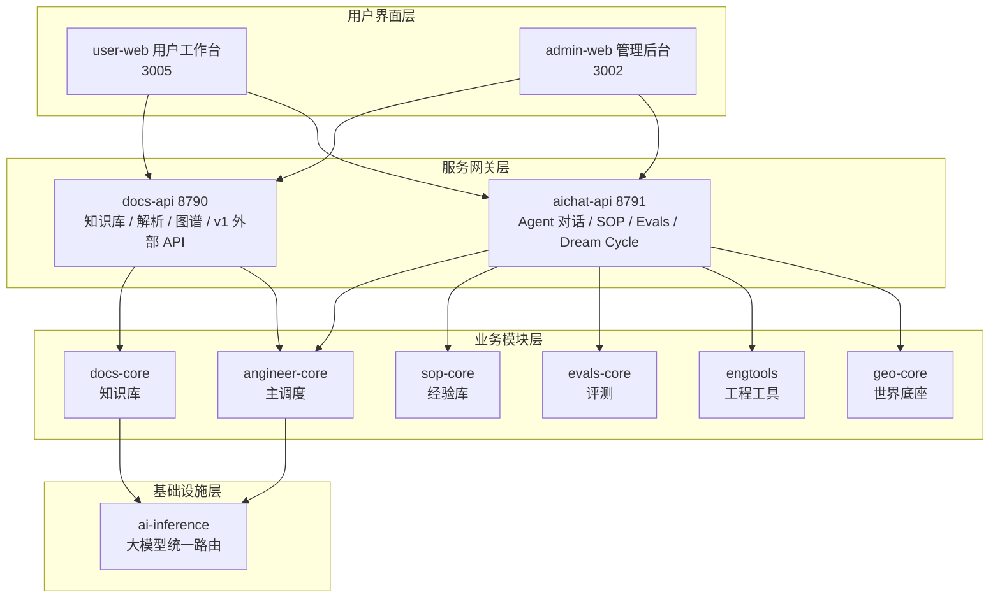
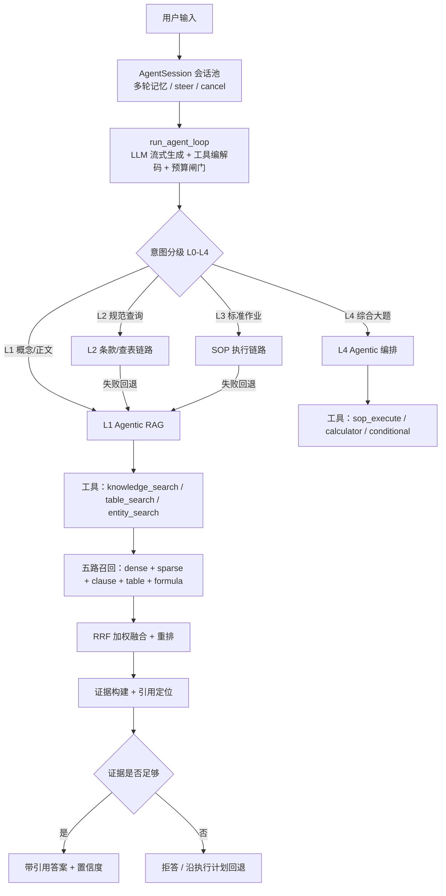
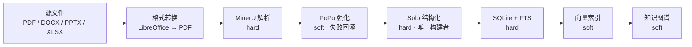
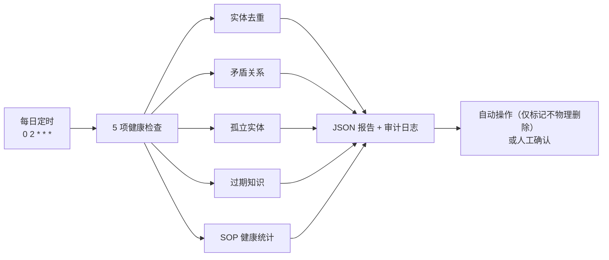
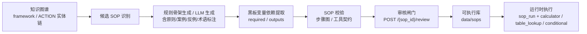
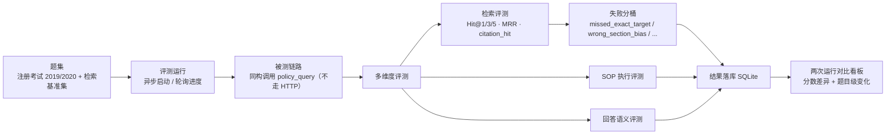
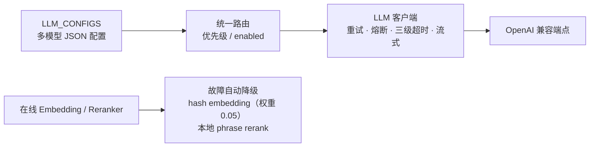

# 🏗️ AnGIneer：工程领域的 AI 工程师

**AnGIneer**（AGI + Engineer）：面向严谨工程领域的 AI 工程师——仅用不微调的小型语言模型（SLM），把规范、SOP、工程工具与地理世界组装成可溯源、可执行的工程智能体。

> **当前版本：v0.2.35** —— 已落地规范问答与 Agent 化问答链路（五路检索、一体化文档解析管线、SOP 审核/审计、注册考试题集评测、Dream Cycle 巡检），v0.2.20 新增图描述（VLM figure_describe 阶段 + 全量回填）、M3.2 证据装配与 QA prompt v8、评测套件多线程并发（EVAL_CONCURRENCY=3）；v0.2.21 升级 QA prompt v9（二元 Yes/No 结论禁止部分证据引申翻转）并撤回 CLAIM 数值/专名守卫（实测正常题误伤，宁漏勿伤，保留半拒答守卫）；v0.2.22 修订 v9 规则 15（证据无明确二元表述时给部分结论并标注缺口、禁止整体拒答，v2 全量 87.68% 历史最高）并将批量删除改为批量接口（软删/硬删，单条失败不中断 + 失败明细）；v0.2.23 解析服务端点 configs 化（MINERU_CONFIGS/POPO_CONFIGS JSON 列表，数组顺序=优先级、主端点失败自动切换，接入 DGX 公网解析并统一 file_parse ZIP 协议），检索/向量性能优化（全量向量矩阵进程缓存），中文数字条款号检索修复（LawBench 法条题精确命中），agent 上下文 top10 截断（prefill 减半）；v0.2.24 端点配置全面统一 `*_CONFIGS` 数组为唯一入口（MinerU/PoPo/Embedding/Reranker，顺序=优先级、失败自动切下一项），删除旧单变量（MINERU_API_URL/POPO_VLLM_URL/DOCS_EMBEDDING_*/ANGINEER_RERANKER_URL 等）兼容层。v0.2.25 新增统计/元数据查询 meta_query 通道（knowledge_stats 实时聚合 + LLM 提取报数，统计问题由 30s+ 拒答改为秒级直报数字；摸底否决裸 text2SQL：主模型 SQL 语义正确率仅 5%），修复 aichat 工具调用 JSON 泄漏到前端（流式围栏过滤）与 PDF 预览失败（nginx 补 .mjs MIME）。v0.2.26 修复 Docker 部署 LibreOffice 转 PDF 中文乱码（backend 镜像补 fonts-noto-cjk 中文字体，存量乱码文档需重跑格式转换阶段），向量索引分批嵌入改双并发（`DOCS_EMBEDDING_BATCH_CONCURRENCY`，默认 2，远程 embedding 场景该阶段耗时近减半）。v0.2.27 修正向量索引提速路线：实测 DGX qwen3-embedding 对并发请求排队执行（双并发比串行慢 ~50%），并发默认回退 1（仅多 worker 本地端点值得调大），改为调大批次（`DOCS_EMBEDDING_BATCH_SIZE` 默认 32，DGX 端点建议 64；批内亚线性 103→59ms/条，该阶段实测可提速 ~2 倍）。v0.2.28 修复 AI 对话拒答重答时中间轮疑问句残留正文气泡（chatTransport 按 turn_start 重置流式正文），检索链路新增分段计时日志（dense/sparse/clause/fuse/rerank 各段耗时可直接定位慢查询），向量矩阵缓存改分批流式构建（消除全量回填后的 OOM 风险），新增 `scripts/rebuild_vectors.py` 全量向量回填工具（切 embedding 模型/向量库后重建 dense 索引，幂等可续跑）。v0.2.29 上线 HTTPS 域名 angineer.cn（网关 80 端口改为 ACME + 全量 301，所有 `*_CONFIGS` 端点从 IP 明文迁到 https://angineer.cn），aichat-api 启动后台预热检索缓存（向量矩阵/FTS，消除冷态首查 sparse 段 12s+）。v0.2.30 修复块级检索指标链：无 section/target 标注的数据集 hit@(sec)/citation_hit 由恒 0.0 改为 N/A（evaluator None 语义 + 报告 — 渲染 + evals-ui 防护），新增 `scripts/open_ragbench/annotate_gold_targets.py` 用金标答案自动回填章节/块/引用标注（subset-v2 已标注 473/487 题），换 embedding 模型后的块级召回质量自此可观测。v0.2.31 修复 meta_query 统计通道误路由（评测实测 9 题内容问题被误判为库统计而必错）：分类器 prompt v3 收紧边界（含统计词但答案在文档正文的一律走正文检索），统计通道新增兜底——产出"统计数据不包含该信息"式答非所问时自动回退 L1 正文检索重答。v0.2.32 agent 上下文截断 top10 放宽到 top15 可配（`ANGINEER_CONTEXT_TOP_N`）：离线覆盖度量（38 道翻转题）实测 top10 仅覆盖金标要点 ~64%、top15 ~70%、top20 ~71%，v0.2.23 的 top10 截断被证实是答案漏要点主因；同 section 去重/低信息块降权等多样性规则变体实测无增益，未采用。v0.2.33 user-web 对话优先首页大改版（极简 Hero 入口→对话页→右侧溯源面板复用 PDF viewer bbox 定位、历史会话 localStorage 持久化 + 右侧抽屉恢复/删除、工作台迁 /workspace 路由，aichat-ui 同步新增 hero 模式/messagesChange/loadSession 三个向后兼容增量）；生产事故三连修：clean-orphaned 孤儿判定从进程内存快照改为直查 nodes 表实况 + 单次批量 >20 条强制 confirm 复核（源于误删事故，99 篇文档索引/向量已从服务器 09-05 快照双端完整恢复，档案与存量待办见 docs/backlog-figure-describe-legacy-docs.md），meta_query 快速通道枚举词收口（"库里有哪些X"类内容题不再误入统计通道）且统计拒答话术守卫同步，knowledge_stats 新增文档标题清单维度（列举题统计通道直答）；夜间维护全内置化（aichat-api 进程内北京时间调度器默认 01:00 启用、evals-core nightly 流水线"当天必有结论"不变式、执行计划预览、管理页调度工具条脏态交互），评测状态机治理（runner 三态如实反映排队/执行/完成、停止按钮 worker 端拦截真生效、服务重启清扫僵尸 running run、幽灵汇总数据修复、"重新评测"按钮按运行时模型语义化）。v0.2.34 评测治理与对话体验合集：评测 53/487 全灭事故三连根治——流式 reasoning 增量事件恒带 text 键（Qwen3.8-Flash 直连 DGX 思考流 KeyError 根因，llm_client 4 处复制粘贴的 extra_body 构建收敛合一）、eval_run 记录 owner_pid（启动清扫只回收属主已死的 running，多实例共库误杀修复）、哨兵 b 全链路留痕被吞 LLM 失败（prediction/scores/run 汇总三级可见 `refusal_via_error`，拒答集"故障满分"假象可识破）；`LLM_CONFIGS` 端点级 `enable_thinking` 显式开关（直连 vLLM/DGX 思考模型可显式关闭提速，优先级高于环境变量与隐式 URL 规则）；评测运行面板交互重排（EvalRunCreateModal 运行/评价/题集三选、进行中 item 置顶带实时状态标签、"重来"原地复用同 run_id 全量重跑、评价模型可选且绝落被测模型自判）；评测管理页三栏/拖拽/树全面复用知识库同款组件（ui-kit 新增 useSplitPanesLayout 共享比例与折叠持久化，拖拽落位兄弟排序真实落库）；user-web 对话首页体验完善（顶栏品牌区含发版摘要、@ 提及文档级圈定检索范围、输入框知识库单选下拉、Shift+Enter 换行修复、references 搜索 500 修复）；向量库维度多数表决 + upsert 拒写异构维度（防异构维度行毒倒全库语义检索）；夜间维护面板宽度对齐知识库列表模式；图描述回填脚本升级（`--from-db` 自动筛存量队列 + `--dry-run` + 管理员会话直连）。 v0.2.35 评测可靠性补强与存量文档图描述补齐归档：向量库期望维度改 index_meta 持久化 O(1) 读取（v0.2.34 的全表多数表决被 embedding_provider 在模块 import 期调用，5.3GB/21 万行库每次容器启动被拖 15+ 分钟、两次部署窗口 502 实踩——meta 缺失才跑一次表决并落库、`strict_dimension=False` 迁移路径清 meta 重算，稳态零扫描）；nightly 基线指针跨平台修复（Windows 钉的基线拷到 Linux 服务器后，反斜杠 raw 被 POSIX Path 当整串文件名拼出双重目录致 nightly FileNotFoundError 无结论失败——读侧 gate 分隔符归一化、写侧 pin 改存 as_posix）；存量文档图描述补齐阶段 1 归档（本地 26 + 生产 77 篇 VLM 全覆盖、4 篇无图块跳过；77 篇源文件在本地文件夹全数找回，本地整目录倒灌 + DB 行级重索引暂停为可选项，详见 docs/backlog-figure-describe-legacy-docs.md）。

**仓库版本**（六个独立仓库各自用 git tag 发布，发版时同步更新本表）：

| 仓库 | 版本 | 说明 |
| :--- | :--- | :--- |
| [AnGIneer](https://github.com/0mao0/AnGIneer) | `v0.2.34` | 主仓库（产品迭代基线） |
| [angineer-docs-ui](https://github.com/0mao0/angineer-docs-ui) | `v0.2.1` | 知识库前端组件库（npm: @angineer/docs-ui） |
| [angineer-aichat-ui](https://github.com/0mao0/angineer-aichat-ui) | `v0.1.7` | 对话前端组件库（npm: @angineer/aichat-ui） |
| [angineer-smartree-ui](https://github.com/0mao0/angineer-smartree-ui) | `v0.1.2` | 通用树组件库 SmartTree（npm: @angineer/smartree） |
| [angineer-table-ui](https://github.com/0mao0/angineer-table-ui) | `v0.1.1` | 通用表格组件库 DataTable（npm: @angineer/table-ui） |
| [angineer-ai-inference](https://github.com/0mao0/angineer-ai-inference) | `v0.1.1` | Python AI 推理客户端库 |

> 核心理念：*"Human Defines SOP, AnGIneer Executes with Precision."*

## Open RAG Benchmark 评测

基于 Vectara Open RAGBench 官方 3045 题分层抽样（seed=42）的评测集：子集 v1 120 题 / 27 篇论文，子集 v2 487 题 / 110 篇论文（均含检索 doc 级指标与拒答专项，详见 `data/open_ragbench/reports/`）。

| 评测轮次 | 题集 | 正确率 | hit@5(doc) | 拒答正确率 |
| :--- | :--- | :--- | :--- | :--- |
| v1 基线（指标修复后重跑） | 120 | 89.2%（107/120） | 95.0% | 84%（25 题） |
| v2 基线（487 题扩样） | 487 | 86.0%（419/487） | 96.1% | — |
| v2 + 图描述进管线（figure_describe 阶段 + 117 篇回填） | 487 | 84.8%（413/487） | 93.2% | 61.5%（39 题） |
| v2 + 图描述 + M3.2/M3.3（revert 能力路由 + QA prompt v8 + 半拒答守卫） | 487 | 87.1%（424/487） | 96.5% | 76.9%（30/39 题） |
| v2 + v9 规则 15 修订（证据无明确二元表述时给部分结论，禁止整体拒答） | 487 | **87.7%（427/487）** | 98.0% | — |
| v2 + 检索/向量优化 + top10 上下文截断 + 中文数字条款号修复（v0.2.23 定版） | 487 | **88.9%（433/487）** | — | — |

> 说明：图描述显著提升图题（text-image 78.0→86.8），但扩大检索面加剧"跨文档错配作答"；M3.2/M3.3 后 text-table 达 84.9%（历史最高）。v0.2.21 起守卫仅保留半拒答拦截（CLAIM 数值/专名守卫经实测在正常题上误伤严重，已撤回——正则级实体忠实性不适用于学术问答）。v0.2.22 起 v9 规则 15 修订版（87.7% 历史最高）：修复"证据无明确二元表述时过度拒答"（如 35fb10a1），保留"禁止细节引申翻转整体结论"的约束。v0.2.23 定版 88.9%：rerank 后仅 top10 进上下文（prefill 减半）+ 全量向量矩阵缓存 + 中文数字条款号直达（ClauseResolver 精确命中，如"第六十条"→"第60条"）。剩余拒答错例为"忠实于同主题文档的跨文档作答"，属检索增强的自然代价。

## LawBench 法条问答评测

基于 [LawBench](https://github.com/open-compass/LawBench) 1-1 法条问答子集（500 题 / 60 部现行法律全文库，条文级检索）。gold 答案存在法律版本错位（如公司法基于 2018 版、知识库为 2023 版），实际分数系统性偏低约 7%。

| 评测轮次 | 题集 | 正确率 | 备注 |
| :--- | :--- | :--- | :--- |
| LawBench 1-1 全量（v0.2.23，500 题全文库） | 500 | **87.6%**（438/500） | 62 题 0 分中 ~36 题为 gold 版本错位（系统答对现行法条但 gold 为旧版条文号），修正后等效 ~94.8% |

### 评测判分（judge）与被测模型解耦（2026-09 起）

语义判分不再使用被测模型自评，避免同源偏差（自评分数会随被测模型精度漂移，无法区分"作答变差"与"judge 变严"）：

- **`EVAL_JUDGE_MODEL`**：指定独立 judge 模型配置名（在 `LLM_CONFIGS` 中注册），所有题集（LawBench / open-ragbench / SOP 评测）的语义判分统一走它；不设置时向后兼容用默认模型
- 消费点唯一：`evals-core/runner/answer_eval.py::_llm_semantic_evaluate`（AnswerEvaluator 与 SopEvaluator 共用）
- 实测案例（2026-09）：LLM 切 NVFP4 后自评差 FP8 基线 -3pt，固定 judge（Qwen3.8-Flash）重判两 run 全部争议题后 **NVFP4 反超 +3.6pt**（60.7% vs 57.1%）——确认差距来自自评同源偏差，模型实际持平略优

***

## 0. 技术亮点（Why AnGIneer）

- **一体化文档解析管线**：MinerU + PoPo 强化 + Solo 结构化 + 索引/图谱，断点恢复、GPU 槽位、产物校验，把"规范 PDF"变成可溯源的结构化知识。
- **可溯源问答**：五路召回（dense / sparse / clause / table / formula）+ 加权融合，表格/公式连同上下文完整返回、查表类问题能答出数值；Prompt 资产化 + 拒答守卫，每条答案都带可点击跳转 PDF 的证据，防编造规范号/背景。
- **Agent Harness**：基于 π-agent 思想的"单一循环原语 + 组合配置"，L0~L4 分级路由 + Attempt 状态机 + 可观测事件流（SSE）；不绑定 Docs，同一套 Harness 可复用于问答、比标、报告等任意 Agent 化场景。
- **对外 API 闭环（工程化）**：X-API-Key 鉴权 + 库级隔离 + 自动建库 + 按真实 API 收纳文档；多租户字段已预留，为 SaaS 化铺路。

## 1. 版本路线与现状

| 版本 | 里程碑 | 核心能力 | 代码现状 |
| :--- | :--- | :--- | :--- |
| **v0.1** | 规范问答基础版 | 文档解析入库、知识图谱、SOP 引擎、L0-L4 意图分级、AI 对话、评测框架 | ✅ 基本完成（git tag `v0.1-frontend-*`） |
| **v0.2** | Docs-SOP 问答系统化改进 | Agent 化问答链路、五路检索 + 融合重排、SOP 审核/审计、Prompt 资产化、一体化文档解析管线 + PoPo 强化、注册考试题集评测、Dream Cycle 知识巡检 | ✅ 已完成，当前迭代基线 v0.2.10 |
| **v0.3** | 世界模型 | 基于 Cesium 的三维地理世界模型，自主查询地理信息（GIS / 水文气象 / 地形），支撑更高级题目 | 🚧 骨架已存在（geo-core GIS 断面算量工具 + GIS 视图），Cesium 集成规划中 |
| **v0.4** | 设计报告 | 基于规范检索、SOP 执行轨迹与地理/计算数据，自动编制工可、初设等正式设计报告 | 🚧 规划中 |
| **v0.5** | CAD 出图算量 | 连接并驱动 CAD 引擎，自动出图、工程量计算，形成"设计 → 出图 → 算量"闭环 | 🚧 规划中，**v0.5 定位为正式版** |
| **v1.0** | 正式版迭代 | 在 v0.5 基础上大量迭代：多专业覆盖、精度与稳定性、工程化与 SaaS 化（多租户） | 🚧 目标 |

> 说明：v0.3–v0.5 描述的是路线目标；仓库当前实际代码基线为 v0.2.10，相关模块已在对应小节中标注"骨架 / 规划中"，避免与已落地能力混淆。

***

## 2. 核心架构

### 2.1 模块关系图


```mermaid
flowchart TB
    subgraph UI["用户界面层"]
        UW["user-web 用户工作台<br/>3005"]
        AW["admin-web 管理后台<br/>3002"]
    end
    subgraph GW["服务网关层"]
        DA["docs-api 8790<br/>知识库 / 解析 / 图谱 / v1 外部 API"]
        AA["aichat-api 8791<br/>Agent 对话 / SOP / Evals / Dream Cycle"]
    end
    subgraph BIZ["业务模块层"]
        CORE["angineer-core<br/>主调度"]
        DOCS["docs-core<br/>知识库"]
        SOP["sop-core<br/>经验库"]
        EVAL["evals-core<br/>评测"]
        TOOL["engtools<br/>工程工具"]
        GEO["geo-core<br/>世界底座"]
    end
    subgraph BASE["基础设施层"]
        AI["ai-inference<br/>大模型统一路由"]
    end

    UW --> DA & AA
    AW --> DA & AA
    DA --> DOCS & CORE
    AA --> CORE & SOP & EVAL & TOOL & GEO
    CORE --> AI
    DOCS --> AI
```

> 说明：AnGIneer-TreeCore 是树操作的通用基础设施（零外部依赖），不参与业务模块关系，故未列入上图；树 UI 组件已独立为 `@angineer/smartree`（`packages/smartree`，独立仓库 angineer-smartree-ui），供 docs-ui / sop-ui / evals-ui / ui-kit 复用。

### 2.2 对外服务边界

| 模块 | 对外暴露 | 鉴权方式 |
| :--- | :--- | :--- |
| **docs-api** | `/api/v1/*`（文档解析 / 产物 / 内容） | `X-API-Key`（管理后台签发，绑定库隔离） |
| **docs-api** | `/api/knowledge`、`/api/graph`（知识库 / 图谱） | 内部代理（前端经 vite/nginx 转发） |
| **aichat-api** | `/api/chat/agent`、`/api/sops`、`/api/evals`、`/api/dream-cycle` | 内部代理（不对外直连） |
| **user-web / admin-web** | 浏览器访问的 Web 界面 | 生产环境：管理端账号密码登录（is_admin 会话鉴权） |

***

### 2.3 AnGIneer-Core 主调度模块

#### (1) Agent 化问答链路


```mermaid
flowchart TB
    U["用户输入"] --> S["AgentSession 会话池<br/>多轮记忆 / steer / cancel"]
    S --> L["run_agent_loop<br/>LLM 流式生成 + 工具编解码 + 预算闸门"]
    L --> C{"意图分级 L0-L4"}
    C -->|"L1 概念/正文"| A1["L1 Agentic RAG"]
    C -->|"L2 规范查询"| A2["L2 条款/查表链路"]
    C -->|"L3 标准作业"| A3["SOP 执行链路"]
    C -->|"L4 综合大题"| A4["L4 Agentic 编排"]
    A2 -->|"失败回退"| A1
    A3 -->|"失败回退"| A1
    A1 --> T["工具：knowledge_search / table_search / entity_search"]
    A4 --> T2["工具：sop_execute / calculator / conditional"]
    T --> R["五路召回：dense + sparse + clause + table + formula"]
    R --> F2["RRF 加权融合 + 重排"]
    F2 --> E["证据构建 + 引用定位"]
    E --> G{"证据是否足够"}
    G -->|"是"| Ans["带引用答案 + 置信度"]
    G -->|"否"| Ref["拒答 / 沿执行计划回退"]
```

#### (2) 分级路由策略

| 层级 | 问题类型 | service_mode | 主处理链路 |
| :--- | :--- | :--- | :--- |
| **L0** | 闲聊寒暄 | `casual_chat` | 直接 LLM 对话，不检索 |
| **L1** | 概念解析 / 定位问答 | `semantic_retrieval` | 多路召回 → 融合 → LLM 基于证据作答 |
| **L2** | 条款应用 / 规范查询 | `structured_lookup` | 条款/表格结构化查证 → 失败回退 L1 |
| **L3** | 标准工程计算 | `standard_sop` | SOP 召回 → 精排 → 参数抽取 → 执行 |
| **L4** | 复杂复合任务 | `dynamic_orchestration` | Agent 循环动态组合多能力链路 |

> 深入阅读：[docs/tech-report.md](docs/tech-report.md#2-angineer-core-主调度模块) · [docs/agent-harness.md](docs/agent-harness.md)

***

### 2.4 AnGIneer-Docs 知识库模块

三块核心链路：一体化解析管线、知识图谱、自进化（Dream Cycle）。

#### (1) 一体化解析管线


```mermaid
flowchart LR
    SRC["源文件<br/>PDF / DOCX / PPTX / XLSX"] --> CV["格式转换<br/>LibreOffice → PDF"]
    CV --> MU["MinerU 解析<br/>hard"]
    MU --> PO["PoPo 强化<br/>soft · 失败回滚"]
    PO --> SOLO["Solo 结构化<br/>hard · 唯一构建者"]
    SOLO --> FTS["SQLite + FTS<br/>hard"]
    FTS --> VEC["向量索引<br/>soft"]
    VEC --> GR["知识图谱<br/>soft"]
```

hard 阶段失败终止后续、soft 阶段失败仅标记自身；支持单阶段重试、断点恢复、GPU 排队与阶段级可视化。

#### (2) 知识图谱模块


```mermaid
flowchart LR
    DOC["文档结构化产物"] --> SEED["种子共现兜底<br/>70+ 工程术语"]
    SEED --> LLM1["LLM 实体 + 关系抽取"]
    LLM1 --> V3["三重验证<br/>V1 跨域 / V2 预测力 / V3 独特性"]
    V3 --> ZK["Zettelkasten 跨段语义连接"]
    ZK --> E5["cangjie E1-E5 提取<br/>原则/案例/反例/术语/框架"]
    E5 --> DB["图谱落库<br/>按 library_id + doc_id 隔离"]
    DB --> REV["人工审核<br/>/api/graph/review"]
```

#### (3) 自进化模块（Dream Cycle）


```mermaid
flowchart LR
    CRON["每日定时<br/>0 2 * * *"] --> CHK["5 项健康检查"]
    CHK --> DEDUP["实体去重"]
    CHK --> CTRD["矛盾关系"]
    CHK --> ORPH["孤立实体"]
    CHK --> STALE["过期知识"]
    CHK --> SOPH["SOP 健康统计"]
    DEDUP & CTRD & ORPH & STALE & SOPH --> RPT["JSON 报告 + 审计日志"]
    RPT --> ACT["自动操作（仅标记不物理删除）<br/>或人工确认"]
```

> **PoPo 子模块注意事项（更新上游时务必保留本地定制）**
>
> `services/docs-core/src/popo` 是 git submodule（MinerU-Popo，MIT 协议）。本地已将 `post_processing/model_utils.py` 中的硬编码 `url=""` / `key=""` 改为读取 `POPO_CONFIGS`（JSON 端点列表：`[{"name","url","api_key","model"}, ...]`，数组顺序=优先级，连接失败/超时自动切下一项；未配置返回空、不打任何请求），并支持 `POPO_API_TIMEOUT`（默认 300s）与 `POPO_MAX_TOKENS`（默认 4096）。**若不保留此修改，PoPo 推理会请求打到 api.openai.com（国内 DNS 污染导致挂死）或空 url 报错。** 更新上游前先 `git -C services/docs-core/src/popo commit` 本地修改，冲突时仅针对该文件手动合并。

> 深入阅读：[docs/tech-report.md](docs/tech-report.md#3-angineer-docs-知识库模块) · [docs/parse-pipeline.md](docs/parse-pipeline.md) · [docs/popo-pipeline.md](docs/popo-pipeline.md) · [docs/knowledge-data-model.md](docs/knowledge-data-model.md)

***

### 2.5 AnGIneer-SOPs 经验库模块

SOP 自动生成链路：


```mermaid
flowchart LR
    GRAPH["知识图谱<br/>framework / ACTION 实体链"] --> CAND["候选 SOP 识别"]
    CAND --> GEN["规则骨架生成 / LLM 生成<br/>含原则/案例/反例/术语标注"]
    GEN --> BB["黑板变量依赖提取<br/>required / outputs"]
    BB --> VAL["SOP 校验<br/>步骤图 / 工具契约"]
    VAL --> REV2["审核闸门<br/>POST /{sop_id}/review"]
    REV2 --> LIB["可执行库<br/>data/sops"]
    LIB --> RUN["运行时执行<br/>sop_run + calculator / table_lookup / conditional"]
```

> 深入阅读：[docs/tech-report.md](docs/tech-report.md#4-angineer-sops-经验库模块) · [docs/sop-extractor-plan.md](docs/sop-extractor-plan.md)

***

### 2.6 AnGIneer-Evals 评测引擎模块


```mermaid
flowchart LR
    DS["题集<br/>注册考试 2019/2020 + 检索基准集"] --> RUN["评测运行<br/>异步启动 / 轮询进度"]
    RUN --> PIPE["被测链路<br/>同构调用 policy_query（不走 HTTP）"]
    PIPE --> MET["多维度评测"]
    MET --> RET["检索评测<br/>Hit@1/3/5 · MRR · citation_hit"]
    MET --> SOPE["SOP 执行评测"]
    MET --> ANS["回答语义评测"]
    RET --> BUCKET["失败分桶<br/>missed_exact_target / wrong_section_bias / ..."]
    BUCKET & SOPE & ANS --> STORE["结果落库 SQLite"]
    STORE --> CMP["两次运行对比看板<br/>分数差异 + 题目级变化"]
```

> 深入阅读：[docs/tech-report.md](docs/tech-report.md#5-angineer-evals-评测引擎模块) · [docs/retrieval-chain.md](docs/retrieval-chain.md)

***

### 2.7 AnGIneer-AI 大模型统一路由模块


```mermaid
flowchart LR
    ENV["LLM_CONFIGS<br/>多模型 JSON 配置"] --> ROUTE["统一路由<br/>优先级 / enabled"]
    ROUTE --> CLIENT["LLM 客户端<br/>重试 · 熔断 · 三级超时 · 流式"]
    CLIENT --> UP["OpenAI 兼容端点"]
    EMB["在线 Embedding / Reranker"] --> DEG["故障自动降级<br/>hash embedding（权重 0.05）<br/>本地 phrase rerank"]
```

`ai-inference` 是 AI 推理唯一真相源（零外部依赖）；Prompt 统一资产化（`prompts/` 带版本号注册），改动 prompt 必须升版本号，CI 强制审计。

> 深入阅读：[docs/tech-report.md](docs/tech-report.md#6-angineer-ai-大模型统一路由模块) · [docs/llm-gateway.md](docs/llm-gateway.md)

***

### 2.8 技术架构与仓库布局

依赖方向（强约束）：

```text
ai-inference（AI 推理唯一真相源，零外部依赖）
    ↑
angineer-core / docs-core / evals-core / sop-core / engtools / geo-core
    ↑
docs-api / aichat-api（服务网关）
    ↑
user-web / admin-web（用户界面层）
```

仓库布局：

```text
apps/
  user-web/           用户工作台（知识库 / SOP / GIS / 对话）· 3005
  admin-web/          管理后台（知识库 / 评测 / SOP / API Key / Dream Cycle）· 3002
  shared/             端口契约 ports.json + API 客户端
packages/
  docs-ui/  aichat-ui/  evals-ui/  sop-ui/  geo-ui/  engtools-ui/  ui-kit/  共享 UI 与组件
  smartree/            通用树组件 SmartTree（独立仓库 angineer-smartree-ui）
  table-ui/            通用表格组件 DataTable（独立仓库 angineer-table-ui）
services/
  ai-inference/       LLM 客户端（多模型/重试/熔断/流式）+ 响应解析（唯一底座）
  tree-core/          通用树节点 CRUD/移动/排序归一化（唯一底座）
  angineer-core/      意图分类、L0-L4 调度、Agent 循环、SOP 执行引擎、Prompt 资产
  docs-core/          一体化解析管线（8 阶段）、五路检索、图谱、维护、导出（含 PoPo 子模块）
  sop-core/           SOP 解析/校验/加载/自动生成
  evals-core/         题集管理、评测运行、结果对比
  geo-core/           GIS 工程计算工具
  engtools/           计算器/查表/条件/知识检索/文档检索工具注册表
  docs-api/           文档解析/知识库/图谱/v1/Key 管理（8790）
  aichat-api/         对话/模型配置/SOP/Evals/DreamCycle（8791）
data/
  knowledge_base/     canonical SQLite、Chroma 向量库、文档产物
  sops/               SOP raw/json/index
  evals/              评测 SQLite 与题集 JSON
  dream_cycle/        巡检报告与审计日志
  api_keys.sqlite     API Key
tests/  docs/  scripts/  docker/
```

> 深入阅读：[docs/tech-report.md](docs/tech-report.md#7-技术架构与仓库布局)

***

## 3. 快速开始

### 3.1 环境准备

```bash
git clone https://github.com/0mao0/AnGIneer.git
cd AnGIneer
```

要求：Python 3.10+、Node.js 20+、pnpm 9。

### 3.2 安装依赖

```bash
# 前端依赖
pnpm install

# 后端依赖（含 evals-core）
pnpm services:install
```

### 3.3 配置环境变量

```bash
cp .env.example .env   # Windows PowerShell: Copy-Item .env.example .env
```

至少需要配置：

- `LLM_CONFIGS`（JSON 数组：显示名 / model / api_key / base_url / priority）
- `MINERU_CONFIGS`（JSON 数组：文档解析端点，顺序=优先级）
- `EMBEDDING_CONFIGS`（JSON 数组：向量端点，顺序=优先级）
- `RERANKER_CONFIGS`（JSON 数组：重排端点，顺序=优先级）
- 若使用 PoPo 强化，还需配置 `POPO_CONFIGS`（JSON 数组：PoPo 端点，顺序=优先级）

### 3.4 启动服务（开发模式）

```bash
pnpm dev:backend    # API:  http://localhost:8789  (文档 /docs)
pnpm dev:frontend   # 用户: http://localhost:3005
pnpm dev:admin      # 管理: http://localhost:3002
```

Windows 也可一键启动：

```powershell
.\start.ps1          # 启动后端 + 管理后台 + 前端
.\start.ps1 -TailLogs
```

### 3.5 初始化 API Key

管理后台 →「API 密钥」页面创建 Key（完整 Key 仅创建时显示一次），用于所有 `/api/v1/*` 接口的 `X-API-Key` 认证。

### 3.6 外部 API 调用示例

```bash
# 提交文档解析
curl -X POST http://localhost:8789/api/v1/documents/parse \
  -H "X-API-Key: ag_your_key_here" \
  -F "file=@document.pdf"

# 轮询解析状态
curl -H "X-API-Key: ag_your_key_here" \
  http://localhost:8789/api/v1/documents/{doc_id}/status

# 获取结构化 blocks
curl -H "X-API-Key: ag_your_key_here" \
  http://localhost:8789/api/v1/documents/{doc_id}/blocks

# 获取正文 / PDF / 产物清单
curl -H "X-API-Key: ag_your_key_here" \
  http://localhost:8789/api/v1/documents/{doc_id}/content
curl -H "X-API-Key: ag_your_key_here" \
  http://localhost:8789/api/v1/documents/{doc_id}/artifacts
```

支持格式：PDF 直接解析；DOCX / PPTX / XLSX 自动经 LibreOffice 转 PDF 后解析。

主要内部 API 分组：

| 前缀 | 能力 |
| :--- | :--- |
| `/api/knowledge/*` | 知识库/文档/解析任务/阶段重试/检索/结构化/编辑同步 |
| `/api/chat/agent` | Agent 化问答 SSE（`steer` / `cancel` 子端点） |
| `/api/sops/*` | SOP CRUD、导入、步骤解析、审核、审计、从文档生成 |
| `/api/graph/*` | 图谱统计/实体/关系/验证/审核/提取器 |
| `/api/evals/*` | 题集/题目/运行/对比 |
| `/api/dream-cycle/*` | 巡检报告/触发/审核确认 |
| `/api/v1/*` | 外部 API（文档解析/产物/内容，需 `X-API-Key`） |

***

## 4. 评测与测试

```bash
# 全量 unittest
pnpm harness

# 端到端工作流（Q1 报告回归）
pnpm harness:workflow

# 工具注册测试
pnpm harness:tooling

# 列出评测题集
pnpm eval:list

# 评测冒烟门禁（20 正例 + 5 拒答，对比基线防回退；需服务已启动）
pnpm harness:eval-smoke
# 更新冒烟基线
python scripts/open_ragbench/run_smoke.py --update-baseline

# 架构/文档一致性检查
pnpm docs:arch-check
pnpm docs:check

# Prompt 资产审计（禁止源码内散落 prompt 字面量）
python scripts/audit_prompts.py
```

检索精度评测：导入 `data/evals/datasets/docs-retrieval-precision-v*.json` 基准集（《海港1》《海港2》《混凝土结构设计规范》），按 `hit@1/3/5`、MRR、citation_hit 与失败分桶回归。

***

## 5. Docker 部署

```bash
cd docker
docker compose up -d --build
```

- 前端（nginx）: `http://localhost/`（用户台），管理后台 `/admin/`
- API: docs-api `http://127.0.0.1:8790`、aichat-api `http://127.0.0.1:8791`（均只绑定本机回环）
- 数据卷：`../data`、`../logs`；API 密钥等配置来自 `../.env`

**公网部署安全**：

- 管理后台 `/admin/` 公网可直连，使用账号密码登录（管理员账号体系见「用户管理」，首个管理员由 `.env` 的 `ADMIN_USER` / `ADMIN_PASSWORD` 启动引导）；管理接口 `/api/users`、`/api/api-keys` 由应用层会话鉴权保护（需 `is_admin` 标记）
- 公网只需暴露 80 端口；8790/8791 已绑定 `127.0.0.1`，外部无法直连后端
- 注意：用户台及其调用的 `/api/knowledge`、`/api/chat` 等接口当前无登录，公网开放即所有人可用，上线前需规划登录/风控
- 对外 API（`/api/v1/*`）需在 Header 携带 `X-API-Key`

**自动部署（GitHub Actions + 自托管 Runner）**：仓库已配置 `.github/workflows/deploy.yml`，每次 push `main` 自动执行 `git pull → docker compose build → docker compose up -d`，并做前端/管理端/API 健康检查与企微通知。

**镜像构建维护注意**：

- 新增 / 重命名 workspace 包时，必须把新包的 `package.json` 加进 `docker/Dockerfile.frontend` 中 `pnpm install --frozen-lockfile` 之前的 `COPY` 清单；否则 pnpm 不会为该包链接 peer 依赖，`vite build` 打包该包源码时会以 `Rollup failed to resolve import ...` 失败（`@angineer/smartree` 拆分时曾实际踩到）。
- `.dockerignore` 的目录模式相对构建上下文根目录匹配，排除嵌套目录必须写成 `**/node_modules`、`**/dist` 等递归形式；只写 `node_modules` 会把各包内嵌依赖目录送进上下文（体积暴涨），且在 Windows 上 pnpm 的 junction 会触发 `archive/tar: unknown file mode` 导致构建失败。

***

## 6. 开发约定

### 6.1 多租户预留（tenant_id 规约）

当前为单租户形态，但所有持久化层**必须预留 `tenant_id` 字段**，为未来 SaaS 化（v2.0）避免 schema 迁移：

- 所有新建表必须包含 `tenant_id TEXT NOT NULL DEFAULT 'default'`，并建立联合索引 `(tenant_id, ...)`。
- 现有表暂不强行迁移；如有 schema 变更时顺带补上。
- 查询路径所有 list/get 接口预留 `tenant_id` 形参（默认 `'default'`），暂不启用过滤。
- 配置项：`ALLOWED_ORIGINS`、`DEFAULT_TENANT_ID`；上线时再启用 API Key → tenant_id 映射。

### 6.2 CORS 配置

生产/对外部署必须通过环境变量显式配置允许的前端来源，禁止使用 `*`：

```
ALLOWED_ORIGINS=https://docs.your-domain.com,https://admin.your-domain.com,https://angineer.cn
```

### 6.3 API Key 认证

所有 `/api/v1/*` 端点需在 Header 携带 `X-API-Key`；Key 通过管理后台 `/api/api-keys` 生成，存储于 `data/api_keys.sqlite`。

### 6.4 PoPo 子模块本地定制

见 [2.4 PoPo 子模块注意事项](#24-angineer-docs-知识库模块)。更新上游时必须保留环境变量版本，否则国内环境 PoPo 推理会挂死。

### 6.5 Prompt 资产化

全部 prompt 的唯一资产区为 `services/angineer-core/src/angineer_core/prompts/`：源码中不允许出现 `你是一个` / `You are a` 等 prompt 字面量；每个 prompt 带版本号并在模块底部 `register(name, version, text)` 登记；**改动 prompt 必须递增版本号**；`scripts/audit_prompts.py` 在 CI 中强制审计。

### 6.6 依赖方向

- `ai-inference` 是 AI 推理的唯一真相源，零外部依赖；上层服务直接 `from ai_inference import ...`，不经过 angineer-core 中转。
- `tree-core` 是树操作唯一真相源，零外部依赖；各服务在自己的 SQLite 中创建 `tree_node` 表并调用 tree_core 操作。

***

## 7. 环境变量参考

| 变量 | 说明 | 默认 |
| :--- | :--- | :--- |
| `LLM_CONFIGS` | LLM 模型配置 JSON 数组（唯一配置入口） | 见 `.env.example` |
| `ANGINEER_DEFAULT_MODEL` | 默认模型名 | `Qwen3.6-Plus` |
| `EVAL_JUDGE_MODEL` | 评测判分专用模型配置名（judge 与被测解耦，见「评测判分」节；不设则用默认模型自评） | 空 |
| `AI_PROVIDER` | AI 服务商（aliyun 等） | `aliyun` |
| `MINERU_CONFIGS` | MinerU 解析端点数组（顺序=优先级，失败自动切换） | JSON 数组 |
| `MINERU_MAX_CONCURRENCY` | MinerU GPU 并发上限 | `1` |
| `MINERU_BACKEND` | MinerU 后端标识 | `hybrid-engine` |
| `EMBEDDING_CONFIGS` | Embedding 端点数组（顺序=优先级，链尾自动补 hash） | JSON 数组 |
| `DOCS_EMBEDDING_PROVIDER` | Embedding 提供方标识（bge_m3/dashscope/hash） | `bge_m3` |
| `DOCS_VECTORSTORE_PROVIDER` | 向量库类型 | `sqlite` |
| `RERANKER_CONFIGS` | Reranker 端点数组（顺序=优先级，失败自动切换） | JSON 数组 |
| `POPO_CONFIGS` | PoPo 强化 LLM 端点数组（顺序=优先级，失败自动切换） | JSON 数组 |
| `POPO_API_TIMEOUT` / `POPO_MAX_TOKENS` | PoPo 超时与最大 token | `300` / `4096` |
| `POPO_MAX_CONCURRENCY` | PoPo 4B 推理并发上限（打远端 vLLM） | `1` |
| `POPO_INFERENCE_RETRIES` | PoPo 推理瞬时失败重试次数 | `1` |
| `ANGINEER_GAP_ANALYSIS_ENABLED` | 回答知识盲区分析开关 | `true` |
| `ANGINEER_FOLLOWUP_QUESTION` | L1/L2 回答末尾追加追问（仅知识问答档生效） | `true` |
| `DREAM_CYCLE_ENABLED` / `DREAM_CYCLE_SCHEDULE` | 巡检开关与 cron | `true` / `0 2 * * *` |
| `DREAM_CYCLE_DEDUP_*` / `DREAM_CYCLE_ORPHAN_*` 等 | 巡检阈值 | 见 `step08_maintain/config.py` |
| `ALLOWED_ORIGINS` | CORS 白名单（逗号分隔） | 本地开发地址 |
| `DEFAULT_TENANT_ID` | 默认租户 | `default` |
| `API_KEYS_DB_PATH` | API Key 数据库路径 | `data/api_keys.sqlite` |
| `LOG_LEVEL` | 日志级别 | `INFO` |

***

## 8. 路线图细节（v0.3 → v1.0）

### v0.3 世界模型

- `geo-core` 扩展：接入真实空间数据源（影像、地形、行政区、水文气象），替换 PicoGIS 模拟引擎。
- `packages/geo-ui` 集成 Cesium 三维场景，GIS 视图从占位升级为可交互地图工作台。
- 地理信息查询工具（坐标 / 行政区 / 流域 / 断面）注册进 Agent 工具集，供 L3/L4 链路自主调用。
- 断面、土方、淹没/影响范围计算与 SOP 执行、报告生成联动。

### v0.4 设计报告

- 报告模板体系：工可、初设、专题报告等正式设计文件结构。
- 自动抽取计算书与图表：引用 SOP 执行轨迹、规范条文、GIS 与工具计算结果。
- 报告生成与导出（Markdown / Word / PDF），支持人工复核与修订。

### v0.5 CAD 出图算量（正式版）

- CAD 引擎适配层：DWG/DXF 读写，AutoCAD / 国产 CAD 驱动。
- 根据设计参数自动出图：平面图、断面图、大样图。
- 工程量自动计算与图纸标注联动，形成"设计 → 出图 → 算量"闭环。

### v1.0 迭代

- 在 v0.5 正式版基础上大量迭代：多专业覆盖、计算精度、稳定性、评测回归与工程化。
- 面向 SaaS 的多租户改造（v2.0 规划）。

***

*AnGIneer - Re-engineering the Future of Engineering.*
