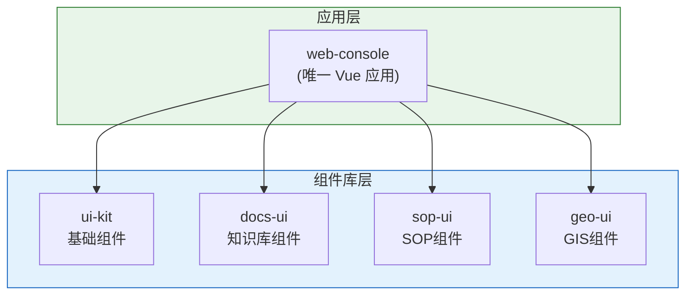

# AnGIneer Apps

> AnGIneer 应用入口层

## 📁 目录结构

```
apps/
├── api-server/           # 后端 API 服务
│   └── main.py          # FastAPI 入口
│
└── web-console/          # 前端应用 (唯一入口)
    ├── src/
    │   ├── App.vue           # 根组件
    │   ├── main.ts           # 入口文件
    │   ├── router/           # 路由配置
    │   ├── stores/           # 全局状态 (Pinia)
    │   ├── layouts/          # 布局组件
    │   │   ├── LeftPanel.vue     # 左侧面板容器
    │   │   ├── Workbench.vue     # 中间工作区容器
    │   │   └── ChatPanel.vue     # 右侧对话区容器
    │   └── views/            # 页面视图
    ├── package.json
    └── vite.config.ts
```

## 🏗️ 前端架构

### 核心原则：单应用 + 多组件库



### web-console vs packages/*-ui

| 位置 | 角色 | Vue框架 | 说明 |
|------|------|---------|------|
| `apps/web-console` | **应用入口** | ✅ 有 | 唯一的 Vue 应用，包含路由、状态、布局 |
| `packages/docs-ui` | **组件库** | ❌ 无 | 只提供 Vue 组件，无独立运行能力 |
| `packages/sop-ui` | **组件库** | ❌ 无 | 只提供 Vue 组件 |
| `packages/geo-ui` | **组件库** | ❌ 无 | 只提供 Vue 组件 |
| `packages/ui-kit` | **组件库** | ❌ 无 | 基础 UI 组件 |


## 📦 依赖关系

### web-console/package.json (应用)

```json
{
  "name": "@angineer/web-console",
  "dependencies": {
    "vue": "^3.4.0",
    "vue-router": "^4.2.0",
    "pinia": "^2.1.0",
    "ant-design-vue": "^4.0.0",
    "@angineer/docs-ui": "workspace:*",
    "@angineer/sop-ui": "workspace:*",
    "@angineer/geo-ui": "workspace:*",
    "@angineer/ui-kit": "workspace:*"
  }
}
```

### packages/docs-ui/package.json (组件库)

```json
{
  "name": "@angineer/docs-ui",
  "peerDependencies": {
    "vue": "^3.4.0",
    "ant-design-vue": "^4.0.0"
  },
  "devDependencies": {
    "vue": "^3.4.0"
  }
}
```

## 🚀 开发指南

### 启动开发服务器

```bash
# 方式1: 从项目根目录
pnpm run dev

# 方式2: 进入 web-console
cd apps/web-console
pnpm run dev
```

### 开发流程

```
1. 在 packages/docs-ui 中开发组件
   ↓
2. web-console 通过 workspace 链接自动获取更新
   ↓
3. 热更新自动生效
```

### 组件库独立测试 (可选)

```bash
cd packages/docs-ui
pnpm run storybook    # 使用 Storybook 独立测试组件
```

## 🔌 模块注册

### 注册侧边栏模块

```typescript
import { createDocsSidebar } from '@angineer/docs-ui'
import { useSidebarStore } from '@angineer/web-console'

const sidebarStore = useSidebarStore()

sidebarStore.registerModule({
  id: 'knowledge-base',
  label: '知识库',
  icon: 'BookOutlined',
  component: createDocsSidebar(),
  order: 1
})
```

### 注册工作区视图

```typescript
import { DocumentViewer } from '@angineer/docs-ui'
import { useWorkbenchStore } from '@angineer/web-console'

const workbenchStore = useWorkbenchStore()

workbenchStore.registerViewer({
  type: 'document',
  component: DocumentViewer,
  extensions: ['md', 'pdf']
})
```

### 注册上下文提供者

```typescript
import { DocsContextProvider } from '@angineer/docs-ui'
import { useContextStore } from '@angineer/web-console'

const contextStore = useContextStore()

contextStore.registerProvider({
  id: 'docs',
  label: '知识库',
  provider: DocsContextProvider,
  trigger: '@'
})
```

## 📄 相关文档

- [packages/README.md](../packages/README.md) - 组件库说明
- [services/README.md](../services/README.md) - 后端服务说明
