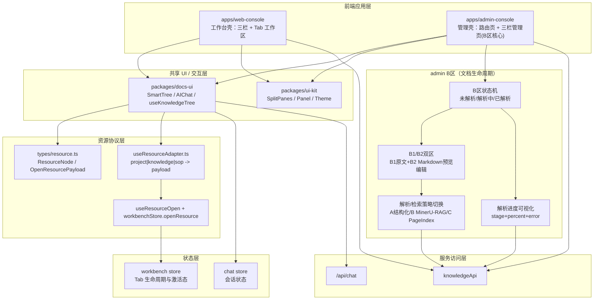
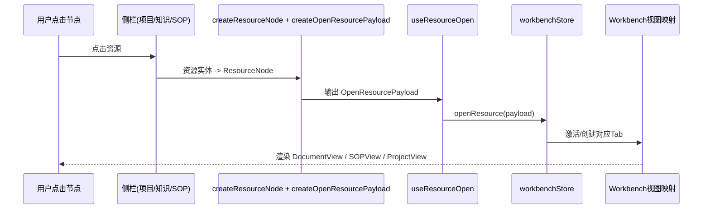
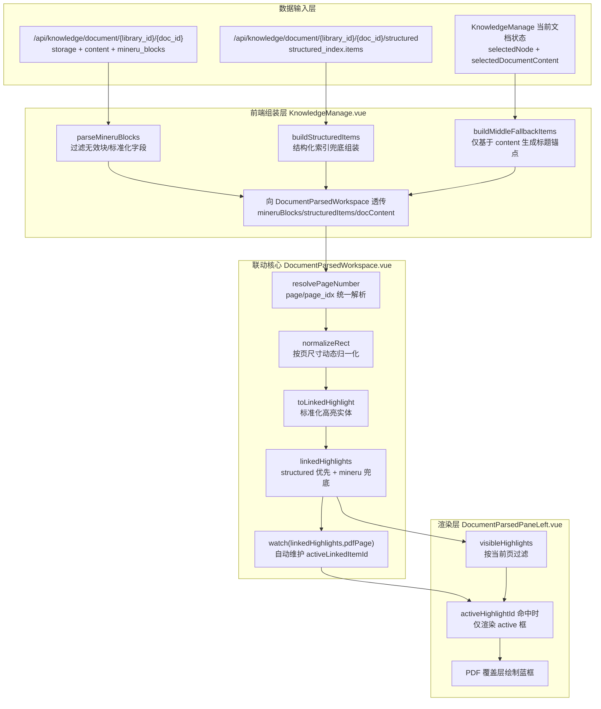
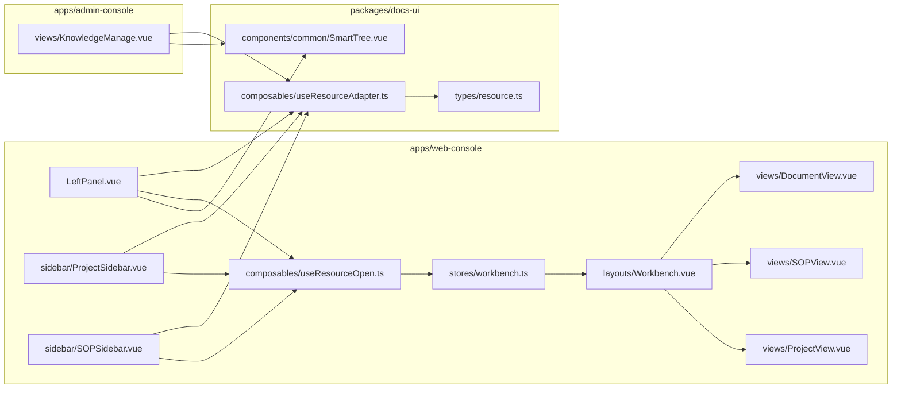

# AnGIneer 技术实现细节

本文档包含项目的详细技术实现、API 规范、组件使用示例。

---

## 目录

- [前端常用命令（自动同步）](#前端常用命令自动同步)
- [前端架构图（重绘）](#前端架构图重绘)
- [PDF 对比高亮逻辑架构（前端）](#pdf-对比高亮逻辑架构前端)
- [文档解析与对比查改改造清单（可直接开工）](#文档解析与对比查改改造清单可直接开工)
- [统一资源架构（已落地）](#统一资源架构已落地)
- [统一资源执行清单（按文件级）](#统一资源执行清单按文件级)
- [AIChat 对话系统](#aichat-对话系统)
- [SmartTree 知识树系统](#smarttree-知识树系统)
- [API 端点速查](#api-端点速查)
- [数据模型](#数据模型)

---

## 前端常用命令（自动同步）

<!-- AUTO_SYNC:APPS_TECH_COMMANDS:START -->
```bash
pnpm install
pnpm dev:frontend
pnpm dev:admin
pnpm build:frontend
pnpm build:admin
pnpm lint
pnpm docs:sync
pnpm docs:check
```
<!-- AUTO_SYNC:APPS_TECH_COMMANDS:END -->

---

## 前端架构图（重绘）

### 分层架构（文档解析改造版）



### 资源打开链路（前端统一）



### 应用壳体职责

```text
web-console（工作台型）
└─ App.vue
   ├─ LeftPanel（项目/知识/SOP 入口）
   ├─ Workbench（统一资源标签页渲染）
   └─ AIChat（共享对话组件）

admin-console（管理路由型）
└─ App.vue
   └─ router-view
      └─ /knowledge -> KnowledgeManage
         ├─ 左：SmartTree（管理态）
         ├─ 中：B区（状态机 + B1/B2 + 策略切换）
         └─ 右：AIChat（共享对话组件）
```

---

## PDF 对比高亮逻辑架构（前端）



---

## 文档解析与对比查改改造清单（可直接开工）

### 1）前端页面（按文件级）

- `apps/admin-console/src/views/KnowledgeManage.vue`
  - 拆分 B 区状态机渲染：未解析、解析中、已解析。
  - 新增策略选择器：`A_structured` / `B_mineru_rag` / `C_pageindex`。
  - 新增解析进度轮询（按 `task_id` 获取进度）。
  - 已解析态改为 B1/B2 双区：左原文，右 Markdown 预览/编辑。
- `apps/admin-console/src/views/components/DocumentPreview.vue`
  - 下沉为“未解析 + 解析中”视图组件。
  - 增加进度条、阶段文案、错误态重试按钮。
- `apps/admin-console/src/views/components/DocumentParsedWorkspace.vue`（新增）
  - 负责 B1/B2 布局、同步滚动、编辑开关、保存/放弃修改。
  - 预留“差异对比模式”入口（首版可只做按钮占位与接口联动）。
- `apps/admin-console/src/api/knowledge.ts`
  - 新增任务接口：`parseDocumentAsync`、`getParseTask`。
  - 新增策略相关接口：`setDocStrategy`、`getDocStrategy`、`queryByStrategy`。
  - 新增编辑接口：`getDocumentEditable`、`saveDocumentEditable`、`listDocumentRevisions`。
- `packages/docs-ui/src/composables/useKnowledgeTree.ts`
  - 扩展节点字段：`parse_progress`、`parse_stage`、`parse_error`、`strategy`。
  - 保持 tree 构建兼容旧字段，避免前后台选择树断裂。

### 2）后端接口（按文件级）

- `apps/api-server/main.py`
  - 将 `/api/knowledge/parse` 改为异步任务提交（返回 `task_id`）。
  - 新增 `/api/knowledge/parse/tasks/{task_id}` 查询进度。
  - 新增 `/api/knowledge/strategies/*`（文档策略设置、按策略检索）。
  - 新增 `/api/knowledge/document/{library_id}/{doc_id}/revisions`。
  - 新增 `/api/knowledge/document/{library_id}/{doc_id}/structured`（统一结构化输出）。
  - 三策略构建逻辑分发到 `services/docs-core/src/docs_core/storage/structured_strategy.py`、`mineru_rag_strategy.py`、`pageindex_strategy.py`。
- `services/docs-core/src/docs_core/parser/mineru_parser.py`
  - 保留 MinerU 解析能力，补充任务阶段回调（若 SDK 无实时进度则用阶段进度）。
  - 增加解析产物清单返回（md、assets、metadata）。
- `services/docs-core/src/docs_core/storage/file_storage.py`
  - 改造为“一文档一目录”结构。
  - 新增路径方法：`get_doc_root`、`save_source_file_with_name`、`save_assets`、`save_revision`。
  - 提供旧路径兼容读取逻辑（迁移期间双读）。
- `services/engtools/src/engtools/config.py`
  - 增加目录解析策略：优先新目录结构，回退旧 `knowledge_base/markdown`。
- `services/engtools/src/engtools/KnowledgeTool.py`
  - 允许 `doc_id` 或逻辑文件名检索，不再仅依赖单 md 文件路径。
- `services/engtools/src/engtools/TableTool.py`
  - 改为优先读取结构化表格索引，回退 Markdown 表格抽取。

### 3）数据表（按文件级）

- `services/docs-core/src/docs_core/api/knowledge_api.py`
  - 现有 `nodes` 表增加字段：
    - `parse_progress INTEGER`
    - `parse_stage TEXT`
    - `parse_error TEXT`
    - `strategy TEXT`
    - `parsed_at TEXT`
    - `edited_at TEXT`
  - 新增 `parse_tasks` 表：任务状态、阶段、进度、错误、起止时间。
  - 新增 `document_artifacts` 表：source/parsed/assets/edited 路径与 hash。
  - 新增 `document_segments` 表：条文/段落/附注等结构化片段。
  - 新增 `document_tables`、`document_images` 表：表格与图片结构化索引。
  - 新增 `document_revisions` 表：编辑版本与 diff 摘要。
  - 新增 `strategy_eval_logs` 表：A/B/C 三策略效果评测记录。

### 4）迁移脚本（按文件级）

- `services/docs-core/src/docs_core/migrations/migrate_doc_layout.py`（新增）
  - 将旧 `source/{library}/{doc_id}.pdf`、`markdown/{library}/{doc_id}/full.md` 迁移到新目录。
  - 迁移后回写 `document_artifacts`。
  - 支持 dry-run 与回滚快照。
- `services/docs-core/src/docs_core/migrations/migrate_engtools_refs.py`（新增）
  - 扫描 engtools 配置与引用，建立旧文件名到 `doc_id` 的映射表。
  - 输出校验报告：可解析/缺失/冲突条目。
- `apps/api-server/main.py`
  - 新增管理端迁移触发接口（仅开发环境启用）。
- `tests/`（补充）
  - 新增迁移脚本单元测试与回归测试：确保旧路径仍可读、新路径优先。

### 5）分阶段交付建议

- P0：B 区状态机 + 异步解析进度 + B1/B2 + Markdown 可编辑。
- P1：A/B/C 策略切换与统一响应结构，支持效果对比。
- P2：结构化索引深挖（表格跨页纠偏、图片语义增强、版本化 diff 可视化）。

---

## 统一资源架构（已落地）

### 组件-文件映射图（新增）



### 当前架构原则

- 共享能力层（组件、协议、适配器），不强制共享页面骨架
- 保持 web-console 工作台模式，保持 admin-console 路由页面模式
- 资源打开统一走 `ResourceNode -> OpenResourcePayload -> workbenchStore.openResource`

## 统一资源执行清单（按文件级）

- `packages/docs-ui/src/types/resource.ts`：定义 `ResourceNode`、`OpenResourcePayload`、`WorkbenchTabType`
- `packages/docs-ui/src/composables/useResourceAdapter.ts`：实现 project/knowledge/sop 到 payload 的统一转换
- `packages/docs-ui/src/types/index.ts`：导出 resource 类型
- `packages/docs-ui/src/composables/index.ts`：导出 resource adapter 能力
- `apps/web-console/src/stores/workbench.ts`：提供 `openResource(payload)` 并统一 Tab 生命周期
- `apps/web-console/src/composables/useResourceOpen.ts`：封装资源打开入口
- `apps/web-console/src/layouts/LeftPanel.vue`：知识节点点击接入统一资源链路
- `apps/web-console/src/layouts/sidebar/ProjectSidebar.vue`：项目入口接入统一资源链路
- `apps/web-console/src/layouts/sidebar/SOPSidebar.vue`：SOP 入口接入统一资源链路
- `apps/web-console/src/layouts/Workbench.vue`：按 `WorkbenchTabType` 统一视图映射
- `apps/web-console/src/views/ProjectView.vue`：project Tab 视图
- `apps/web-console/src/views/DocumentView.vue`：document Tab 视图（props/route 双入口）
- `apps/web-console/src/views/SOPView.vue`：sop Tab 视图（props/route 双入口）
- `apps/admin-console/src/views/KnowledgeManage.vue`：后台复用 adapter 并支持打开前台文档页

---

## AIChat 对话系统

### 组件架构

```
┌─────────────────────────────────────────────────────────────┐
│                    AIChat.vue (UI 组件)                      │
├─────────────────────────────────────────────────────────────┤
│  消息列表区 (MessageList)                                    │
│  输入框区 (InputArea)                                        │
│    ├── 图片上传按钮                                          │
│    ├── 模型选择下拉框 (自适应宽度)                           │
│    └── 发送/停止按钮                                         │
└─────────────────────────────────────────────────────────────┘
                              │
                              ▼
┌─────────────────────────────────────────────────────────────┐
│                  useAIChat.ts (业务逻辑)                     │
├─────────────────────────────────────────────────────────────┤
│  - 消息状态管理                                              │
│  - 流式请求处理                                              │
│  - 上下文压缩                                                │
│  - Token 估算                                                │
└─────────────────────────────────────────────────────────────┘
                              │
                              ▼
┌─────────────────────────────────────────────────────────────┐
│                    chat.ts (Pinia Store)                     │
├─────────────────────────────────────────────────────────────┤
│  - 全局对话状态                                              │
│  - 跨组件消息共享                                            │
└─────────────────────────────────────────────────────────────┘
```

### 前后台拼装方式

- 前台入口 [App.vue](file:///d:/AI/AnGIneer/apps/web-console/src/App.vue) 通过 [LeftPanel.vue](file:///d:/AI/AnGIneer/apps/web-console/src/layouts/LeftPanel.vue) 在「知识」Tab 挂载 SmartTree，使用只读参数集。
- 后台入口 [KnowledgeManage.vue](file:///d:/AI/AnGIneer/apps/admin-console/src/views/KnowledgeManage.vue) 使用 TriplePane 三栏编排，左侧 SmartTree、中心预览、右侧 AIChat。
- 前后台统一复用 [SmartTree.vue](file:///d:/AI/AnGIneer/packages/docs-ui/src/components/common/SmartTree.vue)，只通过 props/slots 区分能力，不维护分叉组件。
- 后台外层“包一层”是业务编排容器，负责文件上传、解析链路、树操作、拖拽重排等流程聚合，属于合理分层。

### AIChat.vue Props

| Prop | 类型 | 默认值 | 说明 |
|------|------|--------|------|
| `defaultModel` | `string` | - | 默认模型 |
| `placeholder` | `string` | `'输入消息...'` | 输入框占位符 |
| `contextItems` | `ContextItem[]` | `[]` | 上下文引用项 |
| `title` | `string` | `'AI 助手'` | 标题 |
| `icon` | `string` | - | 图标 |
| `systemPrompt` | `string` | - | 系统提示词 |
| `showContextInfo` | `boolean` | `false` | 是否显示上下文信息 |
| `showSystemMessages` | `boolean` | `false` | 是否显示系统消息 |

### AIChat.vue Events

| Event | 参数 | 说明 |
|-------|------|------|
| `send` | `(message: string, model: string)` | 发送消息时触发 |
| `ready` | `()` | 组件就绪时触发 |

### AIChat.vue Slots

| Slot | 参数 | 说明 |
|------|------|------|
| `header` | - | 自定义头部 |
| `empty` | - | 空状态自定义内容 |

### 使用示例

```vue
<template>
  <AIChat
    ref="aiChatRef"
    title="AI 助手"
    placeholder="输入消息..."
    :show-context-info="true"
    @send="handleSend"
    @ready="handleReady"
  />
</template>

<script setup>
import { AIChat } from '@angineer/docs-ui'
import { useChatStore } from '@/stores/chat'

const chatStore = useChatStore()

const handleSend = async (message, model) => {
  await chatStore.sendMessage(message)
}
</script>
```

### 输入框底部布局说明

底部操作栏采用三栏布局：

```css
.input-actions {
  display: flex;
  align-items: center;
  gap: 8px;
}

.left-actions {   /* 上传按钮 - 固定 */
  flex-shrink: 0;
}

.center-actions { /* 模型选择 - 自适应 */
  flex: 1;
  max-width: 180px;
}

.right-actions {  /* 发送按钮 - 固定 */
  flex-shrink: 0;
}
```

---

## SmartTree 知识树系统

### 组件架构

```
┌─────────────────────────────────────────────────────────────┐
│                   SmartTree.vue (通用组件)                   │
├─────────────────────────────────────────────────────────────┤
│  搜索栏 (可选)                                               │
│    └── 输入框 + 新增文件夹按钮                               │
│  树内容区                                                    │
│    ├── 树节点                                                │
│    │   ├── 展开/收起图标                                     │
│    │   ├── 节点图标 (slot: icon)                             │
│    │   ├── 节点标题 (slot: title)                            │
│    │   ├── 状态标签 (slot: status)                           │
│    │   └── 操作按钮 (slot: actions)                          │
│    └── 空状态                                                │
│        └── 新增文件夹按钮                                    │
└─────────────────────────────────────────────────────────────┘
```

### 前后台拼装方式

- 前台入口 [App.vue](file:///d:/AI/AnGIneer/apps/web-console/src/App.vue) 通过 [LeftPanel.vue](file:///d:/AI/AnGIneer/apps/web-console/src/layouts/LeftPanel.vue) 在「知识」Tab 挂载 SmartTree，使用只读参数集。
- 后台入口 [KnowledgeManage.vue](file:///d:/AI/AnGIneer/apps/admin-console/src/views/KnowledgeManage.vue) 使用 TriplePane 三栏编排，左侧 SmartTree、中心预览、右侧 AIChat。
- 前后台统一复用 [SmartTree.vue](file:///d:/AI/AnGIneer/packages/docs-ui/src/components/common/SmartTree.vue)，只通过 props/slots 区分能力，不维护分叉组件。
- 后台外层“包一层”是业务编排容器，负责文件上传、解析链路、树操作、拖拽重排等流程聚合，属于合理分层。

### Props

| Prop | 类型 | 默认值 | 说明 |
|------|------|--------|------|
| `treeData` | `SmartTreeNode[]` | `[]` | 树数据 |
| `showSearch` | `boolean` | `true` | 是否显示搜索框 |
| `searchPlaceholder` | `string` | `'搜索...'` | 搜索框占位符 |
| `showAddRootFolder` | `boolean` | `true` | 是否显示“新增一级目录”按钮 |
| `addRootFolderText` | `string` | `'新增文件夹'` | 空状态按钮文本 |
| `addRootFolderTitle` | `string` | `'新增一级目录'` | 搜索区按钮提示 |
| `showStatus` | `boolean` | `true` | 是否显示状态标签 |
| `draggable` | `boolean` | `false` | 是否可拖拽 |
| `allowAddFile` | `boolean` | `true` | 是否允许添加文件 |
| `allowedFileTypes` | `string[]` | `['.pdf']` | 允许上传文件类型 |
| `showIcon` | `boolean` | `true` | 是否显示图标 |
| `emptyText` | `string` | `'暂无数据'` | 空状态文本 |
| `loading` | `boolean` | `false` | 加载状态 |

### Events

| Event | 参数 | 说明 |
|-------|------|------|
| `select` | `(keys: string[], nodes: SmartTreeNode[])` | 选中节点 |
| `add-folder` | `(node: SmartTreeNode \| null)` | 添加文件夹，null 表示根目录 |
| `add-file` | `(node: SmartTreeNode)` | 添加文件 |
| `delete` | `(node: SmartTreeNode)` | 删除节点 |
| `rename` | `(node: SmartTreeNode)` | 重命名节点 |
| `view` | `(node: SmartTreeNode)` | 查看节点 |
| `drop` | `(info: DropInfo)` | 拖拽完成 |
| `search` | `(value: string)` | 搜索 |
| `file-drop` | `(files: File[], targetFolder: SmartTreeNode \| null)` | 文件拖拽上传 |
| `drop-invalid` | `(reason: string)` | 非法拖拽回调 |
| `drop-root` | `(dragNodeKey: string)` | 拖拽到根目录回调 |

### Slots

| Slot | 参数 | 说明 |
|------|------|------|
| `icon` | `{ node: SmartTreeNode }` | 自定义图标 |
| `title` | `{ node: SmartTreeNode, title: string }` | 自定义标题 |
| `status` | `{ node: SmartTreeNode }` | 自定义状态标签 |
| `actions` | `{ node: SmartTreeNode }` | 自定义操作按钮 |
| `empty` | - | 自定义空状态 |

### 使用示例

#### 前台只读模式

```vue
<template>
  <SmartTree
    :tree-data="treeData"
    :show-search="true"
    :show-add-root-folder="false"
    :show-status="false"
    :draggable="false"
    :allow-add-file="false"
    @select="onSelect"
  >
    <template #icon="{ node }">
      <FolderOutlined v-if="node.isFolder" style="color: #faad14" />
      <FileTextOutlined v-else style="color: #1890ff" />
    </template>
  </SmartTree>
</template>

<script setup>
import { SmartTree } from '@angineer/docs-ui'
import { FolderOutlined, FileTextOutlined } from '@ant-design/icons-vue'
</script>
```

#### 后台管理模式

```vue
<template>
  <SmartTree
    :tree-data="treeData"
    :show-search="true"
    :show-add-root-folder="true"
    :show-status="true"
    :draggable="true"
    :allow-add-file="true"
    :allowed-file-types="['.pdf', '.doc', '.docx', '.md']"
    @select="onSelect"
    @add-folder="onAddFolder"
    @add-file="onAddFile"
    @delete="onDelete"
    @drop="onDrop"
    @drop-root="onDropRoot"
  >
    <template #icon="{ node }">
      <FolderOutlined v-if="node.isFolder" style="color: #faad14" />
      <FilePdfOutlined v-else-if="getFileType(node?.title) === 'pdf'" style="color: #ff4d4f" />
      <FileWordOutlined v-else-if="getFileType(node?.title) === 'word'" style="color: #1890ff" />
      <FileMarkdownOutlined v-else-if="getFileType(node?.title) === 'markdown'" style="color: #13c2c2" />
      <FileTextOutlined v-else style="color: #8c8c8c" />
    </template>
    <template #status="{ node }">
      <a-tag :color="node.visible ? 'green' : 'default'">
        {{ node.visible ? '共享' : '本地' }}
      </a-tag>
    </template>
  </SmartTree>
</template>
```

### 拖拽处理

```typescript
const onTreeDrop = async (info: any) => {
  const { dragNode, node: dropNode } = info
  if (!dragNode || !dropNode) return

  if (!info.dropToGap && !dropNode.dataRef?.isFolder) return

  const newParentId = !info.dropToGap
    ? dropNode.key
    : (dropNode.dataRef?.parentId || null)

  const siblings = calcSiblingsAfterDrop()
  await Promise.all(
    siblings.map((item, index) =>
      knowledgeApi.updateNode(item.key, { parent_id: newParentId, sort_order: index })
    )
  )
  await loadNodes(dragNode.key)
}

const onDropRoot = async (dragNodeKey: string) => {
  await knowledgeApi.updateNode(dragNodeKey, { parent_id: null, sort_order: rootLastIndex })
  await loadNodes(dragNodeKey)
}
```

### 可验收能力清单（当前实现）

- 目录：支持根目录/任意父级创建、重命名、递归删除。
- 文件：支持上传、删除、重命名、查看、解析状态展示。
- 类型：后台上传策略统一为 `.pdf/.doc/.docx/.md`，前后端双重校验。
- 搜索：按标题过滤节点并自动展开命中路径。
- 拖拽：支持拖入目录、同级前后重排、拖到根目录，阻止拖入文件和拖入自身后代。
- 交互：上传后自动刷新并定位选中新文件；树有数据时不再错误显示空状态。

### 持久化与数据库

- 知识树服务已使用 SQLite 持久化，见 [knowledge_api.py](file:///d:/AI/AnGIneer/services/docs-core/src/docs_core/api/knowledge_api.py)。
- 默认数据库文件：`data/knowledge.sqlite3`。
- `nodes` 表含 `sort_order` 字段，支持同级顺序持久化与重排。
- 建议使用“整体后端统一数据库”，不建议为 SmartTree 单独建独立数据库。

---

## API 端点速查

### AI 对话

| 端点 | 方法 | 功能 | 位置 |
|------|------|------|------|
| `/api/chat` | POST | AI 流式对话（SSE） | [main.py](file:///d:/AI/AnGIneer/apps/api-server/main.py#L325) |
| `/api/llm_configs` | GET | 获取模型列表 | [main.py](file:///d:/AI/AnGIneer/apps/api-server/main.py#L310) |

**ChatRequest:**
```typescript
{
  message: string        // 当前用户输入
  history: ChatMessage[] // 历史消息
  model?: string         // 模型名称
  mode?: 'chat' | 'reasoning' | 'vision'
  context?: { references?: string[] }
}
```

**SSE 事件类型:**
- `start`: 开始事件，含 messageId
- `chunk`: 增量内容
- `end`: 结束事件，含 usage 统计
- `error`: 错误事件

### 知识树管理

| 端点 | 方法 | 功能 | 位置 |
|------|------|------|------|
| `/api/knowledge/libraries` | GET | 获取知识库列表 | [main.py](file:///d:/AI/AnGIneer/apps/api-server/main.py#L1010) |
| `/api/knowledge/libraries` | POST | 创建知识库 | [main.py](file:///d:/AI/AnGIneer/apps/api-server/main.py#L1016) |
| `/api/knowledge/nodes` | GET | 获取节点列表 | [main.py](file:///d:/AI/AnGIneer/apps/api-server/main.py#L1032) |
| `/api/knowledge/nodes` | POST | 创建节点 | [main.py](file:///d:/AI/AnGIneer/apps/api-server/main.py#L1038) |
| `/api/knowledge/nodes/{id}` | PATCH | 更新节点 | [main.py](file:///d:/AI/AnGIneer/apps/api-server/main.py#L1058) |
| `/api/knowledge/nodes/{id}` | DELETE | 删除节点 | [main.py](file:///d:/AI/AnGIneer/apps/api-server/main.py#L1067) |
| `/api/knowledge/upload` | POST | 上传文档 | [main.py](file:///d:/AI/AnGIneer/apps/api-server/main.py#L1077) |
| `/api/knowledge/parse` | POST | 解析文档 | [main.py](file:///d:/AI/AnGIneer/apps/api-server/main.py#L1113) |
| `/api/knowledge/document/{library_id}/{doc_id}` | GET | 获取文档内容 | [main.py](file:///d:/AI/AnGIneer/apps/api-server/main.py#L1169) |

---

## 数据模型

### SmartTreeNode (前端)

```typescript
interface SmartTreeNode {
  key: string           // 唯一标识
  title: string         // 显示名称
  isFolder?: boolean    // 是否为文件夹
  isLeaf?: boolean      // 是否为叶子节点
  parentId?: string     // 父节点 ID
  filePath?: string     // 源文件路径
  status?: 'pending' | 'processing' | 'completed' | 'failed'
  visible?: boolean     // 是否可见（共享/本地）
  sortOrder?: number    // 同级排序
  children?: SmartTreeNode[]
}
```

### KnowledgeNode (后端)

```python
class KnowledgeNode(BaseModel):
    id: str
    title: str
    type: str              # 'folder' | 'document'
    status: str = 'pending' # pending | processing | completed | failed
    visible: bool = False
    parent_id: Optional[str] = None
    library_id: str
    file_path: Optional[str] = None
    sort_order: int = 0
```

### ChatMessage

```typescript
interface ChatMessage {
  role: 'user' | 'assistant' | 'system'
  content: string
  timestamp?: number
}
```

---

## 状态说明

| 状态 | 说明 | 适用对象 |
|------|------|----------|
| `pending` | 待处理（已上传未解析） | 文件 |
| `processing` | 解析中 | 文件 |
| `completed` | 已完成 | 文件 |
| `failed` | 解析失败 | 文件 |
| `visible` | 共享/本地标识 | 文件 |

**注意**: 文件夹不显示状态标签，仅文件显示。

---

## 开发提示

### 前端

1. **组件导入优先使用 packages**
   ```typescript
   import { SmartTree, AIChat } from '@angineer/docs-ui'
   import { AppHeader, Panel } from '@angineer/ui-kit'
   ```

2. **树数据处理使用 useKnowledgeTree**
   ```typescript
   import { useKnowledgeTree } from '@angineer/docs-ui'
   const { buildTree, findNode } = useKnowledgeTree()
   ```

3. **主题统一使用 useTheme**
   ```typescript
   import { useTheme } from '@angineer/ui-kit'
   const { isDark } = useTheme()
   ```

### Python

1. **函数外增加一句话注释**
   ```python
   # 更新知识库节点
   def update_node(self, node_id: str, **kwargs) -> Optional[KnowledgeNode]:
       """更新节点"""
       ...
   ```

2. **使用 Type Hints**
   ```python
   def create_node(self, node: KnowledgeNode) -> KnowledgeNode:
       ...
   ```
