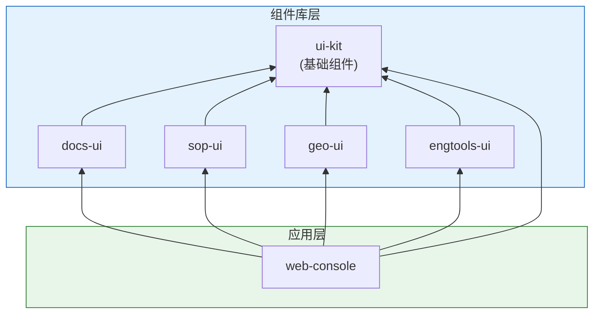

# AnGIneer Frontend Packages

> Vue 3 组件库集合，采用 Monorepo Workspace 管理

## 📁 目录结构

```
packages/
├── docs-ui/              # 知识库组件库
│   ├── src/
│   │   ├── components/       # 组件
│   │   │   ├── sidebar/          # 侧边栏组件
│   │   │   ├── viewer/           # 查看器组件
│   │   │   └── common/           # 通用组件
│   │   ├── composables/      # 组合式函数
│   │   ├── types/            # 类型定义
│   │   └── styles/           # 样式
│   └── package.json
│
├── sop-ui/               # SOP 组件库
│   └── package.json
│
├── geo-ui/               # GIS 组件库
│   └── package.json
│
├── engtools-ui/          # 工程工具组件库
│   └── package.json
│
└── ui-kit/               # 基础 UI 组件库
    ├── src/
    │   ├── components/       # 组件
    │   │   ├── layout/           # 布局组件
    │   │   └── common/           # 通用组件
    │   ├── composables/      # 组合式函数
    │   ├── types/            # 类型定义
    │   └── styles/           # 样式
    └── package.json
```

## 🏗️ 架构原则

### 组件库 vs 应用

| 类型 | 位置 | Vue 框架 | 说明 |
|------|------|----------|------|
| **应用** | `apps/web-console` | ✅ 有 | 唯一的 Vue 应用入口 |
| **组件库** | `packages/*-ui` | ❌ 无 | 纯组件，无独立运行能力 |

### 依赖关系



## 📦 包说明

### @angineer/ui-kit

基础 UI 组件库，提供布局、主题、通用组件。

**主要组件：**
- `AppLayout` - IDE 风格三栏布局
- `Panel` - 可折叠面板
- `SplitPane` - 可调整分割面板
- `Loading` - 加载状态
- `EmptyState` - 空状态
- `ErrorBoundary` - 错误边界

**组合式函数：**
- `useTheme` - 主题管理
- `useLayout` - 布局状态管理

### @angineer/docs-ui

知识库组件库，提供文档浏览、表格查询、公式渲染等功能。

**主要组件：**
- `KnowledgeTree` - 知识库树形导航
- `SearchBox` - 搜索框
- `DocumentViewer` - 文档查看器
- `TableView` - 表格视图（支持查询）
- `FormulaViewer` - 公式查看器
- `ReferenceViewer` - 引用查看器
- `RefAnchor` - 引用锚点

**组合式函数：**
- `useDocument` - 文档操作
- `useQuery` - 表格查询
- `useRefAnchor` - 引用管理

### @angineer/sop-ui

SOP 组件库，提供流程可视化、步骤执行监控。

### @angineer/geo-ui

GIS 组件库，提供地图视图、图层控制。

### @angineer/engtools-ui

工程工具组件库，提供计算器、单位转换等工具界面。

## 🔧 开发指南

### 安装依赖

```bash
# 从项目根目录
pnpm install
```

### 开发模式

```bash
# 启动主应用（自动热更新组件库）
pnpm dev

# 或单独启动前端
pnpm dev:frontend
```

### 构建发布

```bash
# 构建所有包
pnpm build

# 构建单个包
pnpm --filter @angineer/docs-ui build
```

### 组件库独立测试 (可选)

可使用 Storybook 进行组件独立开发和测试：

```bash
cd packages/docs-ui
pnpm storybook
```

## 📝 命名规范

| 类型 | 前缀 | 示例 |
|------|------|------|
| 组件 | 大驼峰 | `DocumentViewer` |
| 组合式函数 | use | `useDocument` |
| 类型 | 大驼峰 | `TableData` |
| 样式文件 | 小写 | `index.less` |
