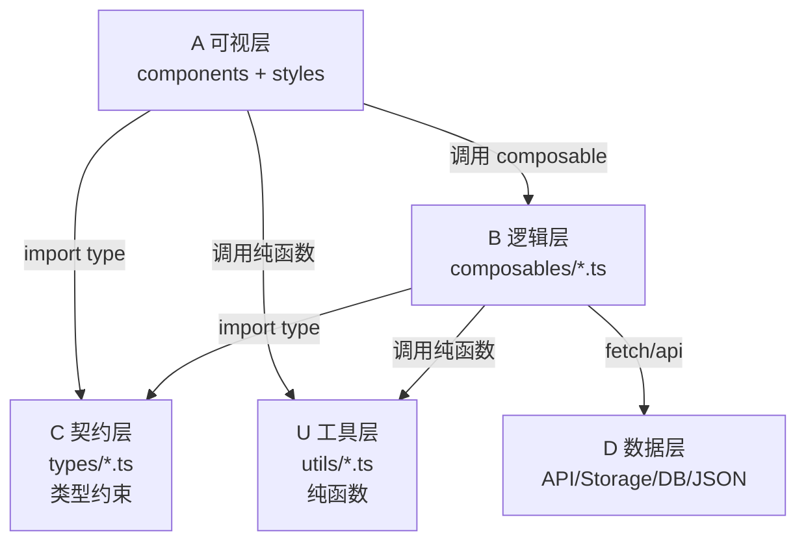
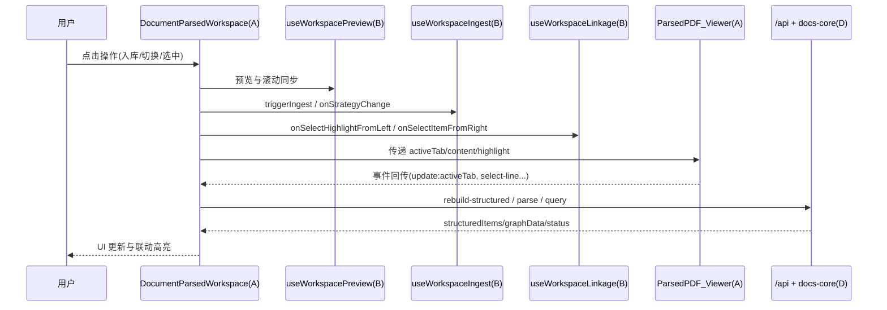
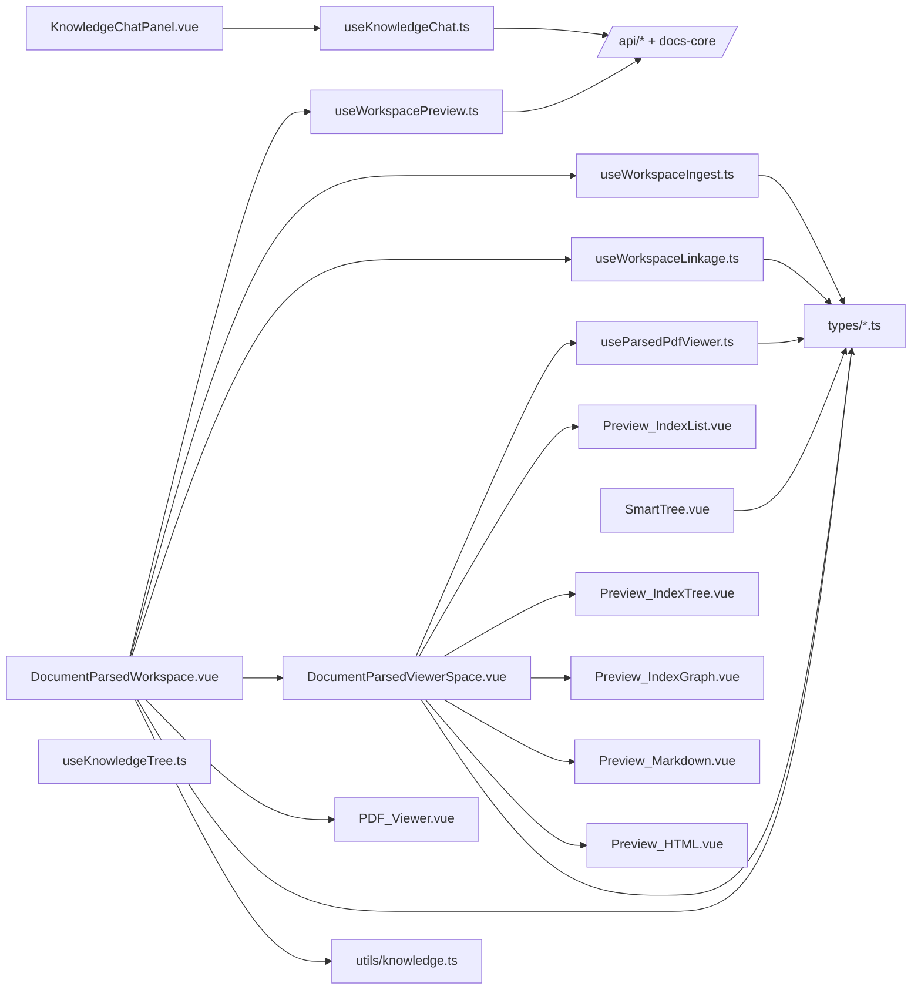

# docs-ui 优化架构说明（A/B/C/D/U 分层）

本文档用于 `packages/docs-ui` 的后续改造与日常阅读，目标是统一分层认知、调用边界和文件职责。

## 1. 分层定义

### A 层：可视层（Components + Styles）
- 只负责 UI 展示、交互触发、事件透传。
- 不直接实现重业务流程，不直接持久化数据。
- 允许存在局部 UI 状态（弹窗开关、hover、tab）。

### B 层：逻辑层（Composables）
- 负责业务流程编排、状态联动、副作用控制。
- 管理运行时状态（`ref/computed/watch`）。
- 调用 D 层接口并把结果映射为 A 层可消费状态。

### C 层：契约层（Types）
- 负责类型契约、结构约束、跨层参数统一。
- 不承载运行时状态，不包含副作用。

### D 层：数据层（API / Storage / Data Source）
- 前端视角：HTTP API（`/api/*`）是 D 层入口。
- 后端视角：文件系统/JSON/DB/第三方解析服务是 D 层落点。

### U 层：工具层（Utils，跨层纯函数）
- 纯函数、无状态、无组件上下文依赖。
- 用于格式化、映射、解析、渲染转换等可复用逻辑。

---

## 2. 当前目录映射（docs-ui）

```text
src/
├─ components/                 # A 层
│  ├─ common/
│  │  ├─ PDFParsedWorkspace.vue
│  │  ├─ PDFParsedViewerCombo.vue
│  │  ├─ PDF_Viewer.vue
│  │  ├─ Preview_HTML.vue
│  │  ├─ Preview_Markdown.vue
│  │  ├─ Preview_IndexList.vue
│  │  ├─ Preview_IndexTree.vue
│  │  ├─ Preview_IndexGraph.vue
│  │  ├─ DocBlocksTreeNode.vue
│  │  ├─ SmartTree.vue
│  │  ├─ KnowledgeChatPanel.vue
│  │  ├─ SOPTree.vue
│  │  └─ SOPChatPanel.vue
│  └─ index.ts
├─ composables/                # B 层
│  ├─ useWorkspacePreview.ts
│  ├─ useWorkspaceLinkage.ts
│  ├─ useWorkspaceIngest.ts
│  ├─ useParsedPdfViewer.ts
│  ├─ useDocBlocksGraph.ts
│  ├─ useKnowledgeTree.ts
│  ├─ useKnowledgeChat.ts
│  ├─ useSopTree.ts
│  ├─ useSopChat.ts
│  ├─ useDocument.ts
│  ├─ useQuery.ts
│  ├─ useRefAnchor.ts
│  ├─ useResourceAdapter.ts
│  └─ index.ts
├─ types/                      # C 层
│  ├─ knowledge.ts
│  ├─ tree.ts
│  ├─ document.ts
│  ├─ reference.ts
│  ├─ resource.ts
│  ├─ table.ts
│  └─ index.ts
├─ utils/                      # U 层
│  ├─ knowledge.ts
│  └─ index.ts
├─ styles/                     # A 层样式
│  ├─ index.less
│  └─ variables.less
└─ index.ts                    # 包出口
```

---

## 3. 层间调用规则（硬约束）

1. A -> B：允许（组件调用 composable）。
2. A -> C：允许（组件 import type）。
3. A -> U：允许（纯函数辅助展示）。
4. B -> C：允许（逻辑层依赖类型契约）。
5. B -> U：允许（业务流程中使用纯函数）。
6. B -> D：允许（fetch/API 调用）。
7. C 不依赖 A/B/D（只做契约）。
8. U 不依赖 A/B 的运行时上下文（只做纯函数）。
9. 禁止 A 直接写 D（组件不直接做复杂数据写入流程，统一由 B 收口）。

---

## 4. 关键调用关系（主流程）

## 4.1 Workspace 解析/预览链路

1. A 层入口：`PDFParsedWorkspace.vue`
2. 该组件组合调用：
   - `useWorkspacePreview`（预览状态与滚动同步）
   - `useWorkspaceIngest`（入库状态与策略）
   - `useWorkspaceLinkage`（左右联动高亮）
3. 右侧编排组件 `PDFParsedViewerCombo.vue` 再调用 `useParsedPdfViewer` 管理索引展示、树图状态、分页与视口。
4. 左侧 `PDF_Viewer.vue` / 右侧 `Preview_*` 子组件通过事件进行双向联动。

## 4.2 结构化索引重建（入库）链路

1. 用户在 A 层触发入库（`trigger-ingest`）。
2. `PDFParsedWorkspace.vue` 调用 B 层 `useWorkspaceIngest.triggerIngest`。
3. 校验通过后触发 `emit('rebuild-structured', strategy)` 给宿主应用。
4. 宿主应用调用 D 层接口（后端 `POST /parse/structured-index`）执行重建。
5. 返回结果后回填到 `structuredItems / structuredStats / graphData`，A 层自动重渲染。

## 4.3 左右联动链路（高亮/定位）

1. 左侧选中高亮：`PDF_Viewer` 触发 `select-highlight`。
2. A 层容器交给 `useWorkspaceLinkage.onSelectHighlightFromLeft`。
3. B 层解析 `graphData + structuredItems + markdownContent` 映射关系，得到：
   - `activeLeftHighlightId`
   - `activeLinkedLineRange`
4. 右侧 `Preview_HTML/Preview_Markdown` 根据行号滚动定位，必要时更新 `pdfPage`。

## 4.4 SmartTree 交互链路

1. `SmartTree.vue` 只发业务事件（如 `add-file`、`add-folder`、`drop`、`search`）。
2. 上层容器接收事件后进入 B 层逻辑（如 `useKnowledgeTree` 或宿主逻辑）。
3. B 层调用 D 层 API / 存储后更新状态，A 层回显。

---

## 5. A 层文件清单（组件职责 + 事件契约）

### 5.1 组件总览

| 文件 | 角色 | 对外事件（核心） | 主要下游依赖 |
|---|---|---|---|
| `PDFParsedWorkspace.vue` | 文档解析工作区编排器 | `parse` `save-content` `change-strategy` `query-structured` `rebuild-structured` | `useWorkspacePreview` `useWorkspaceIngest` `useWorkspaceLinkage` |
| `PDFParsedViewerCombo.vue` | 右侧 pane 编排器 | `update:activeTab` `update:editableContent` `save-markdown` `cancel-markdown` `strategy-change` `trigger-ingest` `content-scroll` `hover-item` `select-item` `toggle-tree-expand` `toggle-graph-expand` `update-graph-viewport` `select-line` | `useParsedPdfViewer` + `Preview_*` |
| `PDF_Viewer.vue` | 左侧文件预览/高亮层 | `download` `text-scroll` `hover-highlight` `select-highlight` | 由 Workspace 注入数据 |
| `Preview_HTML.vue` | HTML 预览（可行选中） | `select-line` | 被 `PDFParsedViewerCombo` 使用 |
| `Preview_Markdown.vue` | Markdown 编辑/预览 | `update:editableContent` `select-line` | 被 `PDFParsedViewerCombo` 使用 |
| `Preview_IndexList.vue` | 索引列表视图 | `hover-item` `select-item` `page-change` | 被 `PDFParsedViewerCombo` 使用 |
| `Preview_IndexTree.vue` | 索引树视图 | `toggle` `select` | 内聚树容器逻辑（使用 `DocBlocksTreeNode` 递归） |
| `Preview_IndexGraph.vue` | 索引图视图 | `toggle` `select` `update-viewport` | 内聚图算法+交互（已合并原 `DocBlocksGraph`） |
| `DocBlocksTreeNode.vue` | 树节点渲染 | `toggle` `select` | 被 `Preview_IndexTree` 递归调用 |
| `SmartTree.vue` | 通用资源树组件 | `select` `rename` `add-folder` `add-file` `delete` `view` `drop` `search` `file-drop` `drop-invalid` `drop-root` | `types/tree` |
| `KnowledgeChatPanel.vue` | 知识域对话面板 | `send` `ready` `removeContext` `error` | `useKnowledgeChat` |
| `SOPTree.vue` | 经验库语义树组件 | `select` `view` `search` | `useSopTree` |
| `SOPChatPanel.vue` | 经验库对话面板 | `send` `ready` `removeContext` `error` | `useSopChat` |

### 5.2 Workspace 核心编排函数（`DocumentParsedWorkspace.vue`）

- `saveMarkdown`：把右侧编辑内容回传为 `save-content`。
- `cancelMarkdownEdit`：回滚编辑缓存并复位 dirty 状态。
- `triggerIngest`：调用 `requestIngest` 后触发 `rebuild-structured`。
- `onStrategyChange`：同步策略并发出 `change-strategy`。
- `openIndexFromIngestModal`：切换到索引 tab 并关闭 modal。

---

## 6. B 层文件清单（函数/状态与职责）

### 6.1 composables 导出总表

| 文件 | 导出函数 | 核心职责 |
|---|---|---|
| `useWorkspacePreview.ts` | `useWorkspacePreview` | 文件类型识别、预览 URL、左右滚动同步、PDF 页码映射 |
| `useWorkspaceIngest.ts` | `useWorkspaceIngest` | 入库弹窗状态、策略切换、入库可用性校验、统计聚合 |
| `useWorkspaceLinkage.ts` | `useWorkspaceLinkage` | structured item 与 graph node 映射、左/右选择联动、行号与页码同步 |
| `useParsedPdfViewer.ts` | `useParsedPdfViewer` | 右侧索引列表/树/图的统一状态、分页、展开、视口持久 |
| `useDocBlocksGraph.ts` | `useDocBlocksGraph` | 图结构状态容器（nodeMap/childrenMap/roots）与视图模式控制 |
| `useKnowledgeTree.ts` | `useKnowledgeTree` | 知识树运行时状态与节点操作（选中、状态更新、上传任务） |
| `useKnowledgeChat.ts` | `useKnowledgeChat` | 对话流式发送、上下文窗口管理、终止/清空、token 估算 |
| `useSopTree.ts` | `useSopTree` | 经验库树默认数据、查找与选中状态管理 |
| `useSopChat.ts` | `useSopChat` | 经验库聊天语义封装与默认系统提示词 |
| `useDocument.ts` | `useDocument` | 文档/库查询、块查询 |
| `useQuery.ts` | `useQuery` | 表查询与语义查询、历史记录 |
| `useRefAnchor.ts` | `useRefAnchor` | 引用上下文管理、引用拉取、复制 |
| `useResourceAdapter.ts` | `createResourceNodeFrom*` `createOpenResourcePayload` | 资源结构适配与工作台打开 payload 构建 |

### 6.2 关键函数清单（按文件）

#### `useWorkspacePreview.ts`
- 状态：`textContent` `leftScrollPercent` `rightScrollPercent` `pdfPage`
- 计算：`isPdf` `isOffice` `isImage` `isText` `fileUrl` `pdfViewerUrl` `officePreviewUrl` `inferredPdfPageCount`
- 方法：`onRightPaneScrollPercent` `onLeftTextScrollPercent` `downloadFile` `resetPreviewState`

#### `useWorkspaceIngest.ts`
- 状态：`ingestModalVisible` `selectedStrategy`
- 计算：`ingestProgressStatus` `ingestStageText` `strategyValue` `structuredTotal` `indexSummaryStats` `ingestButtonText` `canIngest`
- 方法：`onStrategyChange` `triggerIngest` `openIngestModal` `closeIngestModal`

#### `useWorkspaceLinkage.ts`
- 状态：`activeLinkedItemId` `highlightLinkEnabled`
- 计算：`linkedHighlights` `showHighlightToggle` `activeLeftHighlightId` `activeLinkedLineRange`
- 方法：`onHoverLinkedItem` `onSelectHighlightFromLeft` `onSelectItemFromRight` `onSelectLineFromRight` `toggleHighlightLink` `resetLinkageState`

#### `useParsedPdfViewer.ts`
- 状态：`indexCurrentPage` `expandedNodeIds` `expandedGraphNodeIds` `graphViewportState`
- 计算：`flatIndexItems` `nodeMap` `childrenMap` `roots` `activeNodeIdForGraphTree`
- 方法：`onTabChange` `onIndexPageChange` `onTreeToggle` `onGraphToggle` `onNodeSelect` `onViewportUpdate` `expandAncestors` `setViewMode`

#### `useDocBlocksGraph.ts`
- 状态：`graph` `activeNodeId` `expandedNodeIds` `expandedGraphNodeIds` `viewMode` `viewportState`
- 方法：`loadGraph` `setActiveNode` `toggleExpand` `toggleGraphExpand` `expandAll` `collapseAll` `setViewMode` `setViewportState`
- 查询：`getAncestors` `expandAncestors` `getNodeLevel` `getNodeText` `getChildren`

#### `useKnowledgeTree.ts`
- 状态：`treeData` `selectedKeys` `expandedKeys` `selectedNode` `uploadTasks`
- 方法：`buildTree` `findNode` `getChildCount` `getFolderName` `selectNode` `updateNodeStatus` `addUploadTask` `updateUploadTask` `setTreeData`

#### `useKnowledgeChat.ts`
- 状态：`messages` `inputText` `loading` `currentStreamContent`
- 方法：`sendMessage` `stopGeneration` `clearMessages` `getContextTokens` `getContextRounds` `generateMessageId`
- 类型：`KnowledgeChatMessage` `KnowledgeChatRequest` `KnowledgeChatStreamEvent` `KnowledgeChatContextConfig`

#### `useDocument.ts`
- 状态：`document` `loading` `error`
- 方法：`fetchDocument` `fetchLibrary` `searchDocuments` `getBlock` `getBlocksByType`

#### `useQuery.ts`
- 状态：`result` `loading` `error` `history`
- 方法：`queryTable` `semanticQuery` `clearHistory`

#### `useRefAnchor.ts`
- 状态：`contextItems` `loading`
- 方法：`addContext` `removeContext` `clearContext` `fetchReference` `copyReference` `getContextText`

#### `useResourceAdapter.ts`
- 适配函数：`createResourceNodeFromKnowledge` `createResourceNodeFromProject` `createResourceNodeFromSop`
- 跳转函数：`createOpenResourcePayload`

---

## 7. C 层契约清单（types）

### 7.1 `types/knowledge.ts`
- `KnowledgeStrategy = 'doc_blocks_graph_v1'`
- `IngestStatus = 'idle' | 'processing' | 'completed' | 'failed'`
- `ParseTaskInfo`
- `StructuredIndexItem`
- `StructuredStats`
- `DocumentStorageManifest`
- `DocBlockNode`
- `DocBlockEdge`
- `DocBlocksGraph`
- `DocBlocksGraphState`

### 7.2 `types/tree.ts`
- `SmartTreeNode`
- `TreeNodeAction`

### 7.3 其他契约
- `types/document.ts`：`Document` `DocumentBlock` `BlockLocation` `DocumentMetadata` `Library`
- `types/resource.ts`：`ResourceType` `WorkbenchTabType` `ResourceNode` `OpenResourcePayload`
- `types/reference.ts`：`Reference` `ReferenceLocation` `ReferenceContext` `CrossReference`
- `types/table.ts`：`TableData` `TableType` `TableDimension` `ValueRange` `TableOutput` `TableRule` `TableQueryResult`

---

## 8. U 层工具清单（utils）

### `utils/knowledge.ts`
- `getFileExtension(path)`：扩展名提取
- `getPreviewFileType(node)`：预览类型映射（pdf/word/markdown/image/text/file）
- `mapParseStageText(stage, parseError)`：解析阶段文案映射
- `mapNodeStatusText(status)`：节点状态文案映射
- `renderMarkdownToHtml(content, sourceFilePath)`：Markdown + KaTeX 渲染为 HTML，并处理资源路径

工具层定位：可在 A/B 任意层调用，但保持“纯函数、无运行时状态”。

---

## 9. D 层数据源映射（当前项目实际）

> `docs-ui` 前端通过 `/api/*` 与后端交互；数据持久化和解析产物在 `services/docs-core` 完成。

### 9.1 前端调用入口（B -> D）
- `useDocument.ts`：`/api/docs/documents/*` `/api/docs/libraries/*` `/api/docs/search`
- `useQuery.ts`：`/api/docs/tables/*/query` `/api/docs/query/semantic`
- `useRefAnchor.ts`：`/api/docs/references/*`
- `useKnowledgeChat.ts`：`/api/chat`
- 预览文件：`/api/files?path=...`

### 9.2 后端解析/存储关键点（D 层落盘）
- 解析任务接口：`apps/api-server/knowledge_routes.py`
  - `POST /parse`
  - `GET /parse/{task_id}`
  - `POST /parse/structured-index`
- 存储实现：`services/docs-core/src/docs_core/storage/document_storage.py`
  - 根目录：`data/knowledge_base`
  - 文档目录：`libraries/{library_id}/documents/{doc_id}/`
  - 关键文件：`parsed/content.md` `parsed/middle.json` `parsed/mineru_blocks.json` `parsed/raw/*` `edited/current.md`

---

## 10. 包出口与使用建议

### 10.1 出口文件
- `src/index.ts`：聚合导出 components/composables/types/utils
- `src/components/index.ts`：导出 `SmartTree` `KnowledgeTree` `KnowledgeChatPanel` `SOPTree` `SOPChatPanel` `DocumentParsedWorkspace` `DocBlocksTreeNode`
- `src/composables/index.ts`：导出全部 composables 及关键类型
- `src/types/index.ts`：导出所有契约类型
- `src/utils/index.ts`：导出工具函数

### 10.2 新功能放置规范（改造准则）
- 新 UI：优先放 A 层 `components/common/*`，样式仅放本组件所需。
- 新业务流程：优先放 B 层 composable，组件只消费状态与方法。
- 新数据结构：先定义到 C 层 type/interface，再落逻辑实现。
- 新纯算法/映射：放 U 层 utils，保持无副作用。
- 新 API/存储交互：统一由 B 层发起，不从 A 层直接发起复杂流程。

---

## 11. 改造检查清单（提交前自检）

1. 是否把流程逻辑从组件下沉到 composable。
2. 是否存在组件直接处理复杂 API/落盘流程（应避免）。
3. 类型是否先在 C 层定义，再被 A/B 复用。
4. utils 是否仍保持纯函数，不引入状态/副作用。
5. 事件命名是否保持语义一致（`select-*`、`toggle-*`、`update:*`）。
6. Workspace 是否继续作为编排器，而非逻辑堆积点。

---

## 12. 逐文件外部依赖与调用矩阵（细化）

> 这一节聚焦“文件 -> 引用谁 -> 对外暴露什么 -> 在分层里承担什么角色”。

### 12.1 A 层组件矩阵（common）

| 文件 | 直接引用的外部 TS/函数 | 对外事件（emit） | 分层结论 |
|---|---|---|---|
| `DocumentParsedWorkspace.vue` | `useWorkspacePreview` `useWorkspaceIngest` `useWorkspaceLinkage` `mapParseStageText` `renderMarkdownToHtml` `KnowledgeTreeNode` `KnowledgeStrategy/IngestStatus/Structured*` | `parse` `save-content` `change-strategy` `query-structured` `rebuild-structured` | A 层编排器，强依赖 B/C/U，合理 |
| `ParsedPDF_Viewer.vue` | `useParsedPdfViewer` `PreviewMode` `KnowledgeStrategy` `StructuredIndexItem` `DocBlocksGraph` | `update:activeTab` `update:editableContent` `save-markdown` `cancel-markdown` `strategy-change` `trigger-ingest` `content-scroll` `hover-item` `select-item` `toggle-tree-expand` `toggle-graph-expand` `update-graph-viewport` `select-line` | A 层二级编排器，依赖 B/C |
| `PDF_Viewer.vue` | `KnowledgeTreeNode`（来自 `types/tree`） | `download` `text-scroll` `hover-highlight` `select-highlight` | A 层渲染组件，轻依赖 C |
| `Preview_HTML.vue` | 无项目外部 TS（仅 Vue） | `select-line` | A 层纯展示 |
| `Preview_Markdown.vue` | 无项目外部 TS（仅 Vue） | `update:editableContent` `select-line` | A 层纯展示 |
| `Preview_IndexList.vue` | `StructuredIndexItem` `DocBlockNode`（C） | `hover-item` `select-item` `page-change` | A 层列表展示 |
| `Preview_IndexTree.vue` | `DocBlockNode`（C）+ `DocBlocksTreeNode.vue` | `toggle` `select` | A 层树组件（内聚交互） |
| `Preview_IndexGraph.vue` | `DocBlockNode`（C） | `toggle` `select` `update-viewport` | A 层图组件（内聚交互） |
| `DocBlocksTreeNode.vue` | `DocBlockNode`（C） | `toggle` `select` | A 层节点 |
| `SmartTree.vue` | `SmartTreeNode`（C） `TreeProps` `useTheme` | `select` `rename` `add-folder` `add-file` `delete` `view` `drop` `search` `file-drop` `drop-invalid` `drop-root` | A 层通用组件，不直接做 D 层写入 |
| `KnowledgeChatPanel.vue` | `useKnowledgeChat`（B） | `send` `ready` `removeContext` `error` | A 层业务组件，状态在 B |
| `SOPTree.vue` | `SOPTreeNode`（C） + `SmartTree` | `select` `view` `search` | A 层经验库树语义包装 |
| `SOPChatPanel.vue` | `useSopChat`（B） + `BaseChat` | `send` `ready` `removeContext` `error` | A 层经验库聊天语义包装 |

### 12.2 B 层 composables 矩阵

| 文件 | 主要输入 | 主要输出（状态/函数） | 是否直接触达 D 层 |
|---|---|---|---|
| `useWorkspacePreview.ts` | `node/filePath/graphData` | `isPdf/isOffice/...` `fileUrl` `pdfViewerUrl` `onRightPaneScrollPercent` `onLeftTextScrollPercent` | 否（仅读取文件 URL） |
| `useWorkspaceIngest.ts` | `node/content/isContentDirty/ingestStatus/structuredStats` | `ingestModalVisible` `strategyValue` `canIngest` `triggerIngest` | 否 |
| `useWorkspaceLinkage.ts` | `graphData/structuredItems/markdownContent/isPdf/pdfPage/rightScrollPercent` | `linkedHighlights` `activeLinkedLineRange` `onSelect*` | 否 |
| `useParsedPdfViewer.ts` | 右侧 pane props + emit | `flatIndexItems/nodeMap/childrenMap` `onTabChange` `onTreeToggle` | 否 |
| `useDocBlocksGraph.ts` | `DocBlocksGraph` | `nodeMap/childrenMap/roots` `toggleExpand` `setViewMode` | 否 |
| `useKnowledgeTree.ts` | 运行时树数据 | `treeData/selectedNode` `buildTree/selectNode/updateNodeStatus` | 否 |
| `useKnowledgeChat.ts` | 对话参数与上下文配置 | `messages/loading/sendMessage/stopGeneration` | 是（`/api/chat`） |
| `useSopTree.ts` | 经验库树数据 | `treeData/selectedNode/resetToDefaultTree/findNode` | 否 |
| `useSopChat.ts` | 经验库对话参数 | `messages/loading/sendMessage/stopGeneration` | 是（复用 `/api/chat`） |
| `useDocument.ts` | `docId/libraryId/query` | `document/loading/error` `fetchDocument` `searchDocuments` | 是（`/api/docs/*`） |
| `useQuery.ts` | `tableId/params/question` | `result/history/queryTable/semanticQuery` | 是（`/api/docs/*`） |
| `useRefAnchor.ts` | `blockId/reference` | `contextItems` `fetchReference` `copyReference` | 是（`/api/docs/references/*`） |
| `useResourceAdapter.ts` | `SmartTreeNode/ProjectItem/SopItem` | `ResourceNode/OpenResourcePayload` | 否（纯适配） |

### 12.3 C 层契约文件矩阵

| 文件 | 核心契约 |
|---|---|
| `types/knowledge.ts` | `KnowledgeStrategy` `IngestStatus` `StructuredIndexItem` `StructuredStats` `DocBlockNode` `DocBlocksGraph` |
| `types/tree.ts` | `SmartTreeNode` `TreeNodeAction` |
| `types/document.ts` | `Document` `DocumentBlock` `Library` |
| `types/reference.ts` | `Reference` `ReferenceContext` |
| `types/resource.ts` | `ResourceNode` `OpenResourcePayload` |
| `types/table.ts` | `TableQueryResult` 等表结构契约 |

### 12.4 U 层工具函数矩阵

| 文件 | 函数 | 常见调用方 |
|---|---|---|
| `utils/knowledge.ts` | `getFileExtension` `getPreviewFileType` | A/B 层文件类型识别 |
| `utils/knowledge.ts` | `mapParseStageText` `mapNodeStatusText` | A 层状态文案展示 |
| `utils/knowledge.ts` | `renderMarkdownToHtml` | `DocumentParsedWorkspace.vue` |

---

## 13. 架构演进建议（按触发条件）

### 13.1 何时引入 Pinia Store（非强制）

满足任意两条时建议引入：

1. 同一份状态被 3 个以上页面/区域复用。
2. A 层出现明显 props drilling（多级透传）。
3. 同一逻辑在多个 composable 重复实现。
4. 需要跨页面缓存、乐观更新、统一回滚。
5. 需要统一收口 websocket/polling 增量数据。

### 13.2 推荐的最小 Store 切入点

可先落一个 `knowledgeWorkspaceStore`，仅收口这三类状态：

1. `activeDocId` / `activeTab`
2. `structuredItems` / `graphData`
3. `ingestStatus` / `ingestStage`

其余状态继续留在 composables，避免一次性大迁移。

### 13.3 保持稳定的边界规则

1. Store 持有“跨组件共享状态”，不持有重展示逻辑。
2. Composable 负责“流程与副作用”，可读写 store。
3. Utils 继续保持纯函数，不依赖 store。
4. Types 始终先于实现定义，作为改造护栏。

---

## 14. 架构关系图（3 张）

### 14.1 分层总览图（A/B/C/D/U）



### 14.2 Workspace 运行时调用图（你当前主链路）



### 14.3 组件与 composables 依赖图（核心模块）



---

## 15. 第一批改造清单（逐文件可执行）

### 15.1 已落地（低风险去冗余）

1. `useWorkspacePreview.ts`：删除本地扩展名/预览类型重复判断，统一复用 `utils/knowledge.ts` 的 `getFileExtension` 与 `getPreviewFileType`。
2. `Preview_IndexList.vue`：删除组件内重复实现，改为复用 `utils/knowledge.ts` 的 `stripMarkdownSyntax` 与 `formatStructuredItemType`。
3. `useParsedPdfViewer.ts` + `useDocBlocksGraph.ts`：抽出 `buildDocBlocksGraphIndex`，统一构建 `nodeMap/childrenMap/parentMap/roots`，删除重复图索引逻辑。
4. `useKnowledgeTree.ts` + `types/tree.ts`：把知识树契约集中到 `types/tree.ts`，统一为 `KnowledgeTreeNode`（不再保留 `TreeNode` 别名），移除 composable 内重复类型声明。
5. `DocumentParsedWorkspace.vue` + `ParsedPDF_Viewer.vue` + `useParsedPdfViewer.ts`：统一 `PreviewMode` 与图视口事件载荷类型，收敛 `update-graph-viewport` 的重复对象定义。
6. `DocumentParsedWorkspace.vue` + `types/knowledge.ts`：提炼 `DocumentParsedWorkspaceEventMap`，统一 `parse/query/rebuild/save-content/change-strategy` 事件契约。
7. `Preview_IndexTree.vue` + `Preview_IndexGraph.vue` + `types/knowledge.ts`：提炼 `PreviewIndexInteractionEventMap`，统一 `toggle/select/update-viewport` 事件命名与载荷结构。
8. `Preview_IndexTree.vue` + `Preview_IndexGraph.vue`：图树事件源统一为 `toggle/select/update-viewport`，移除命名适配分支。
9. 结果：预览链路、图链路与知识树链路共享统一契约入口，减少结构漂移风险。

### 15.2 下一批建议（按优先级）

1. 暂无（第一批改造清单已完成）。

### 15.3 每项改造验收标准

1. 单项改造后 `pnpm run lint` 必须通过。
2. 不改变现有交互行为（入库、联动高亮、页签切换）。
3. 同类能力只保留一个实现位置（函数/映射/类型）。
4. A 层不新增对 D 层的直接依赖。

