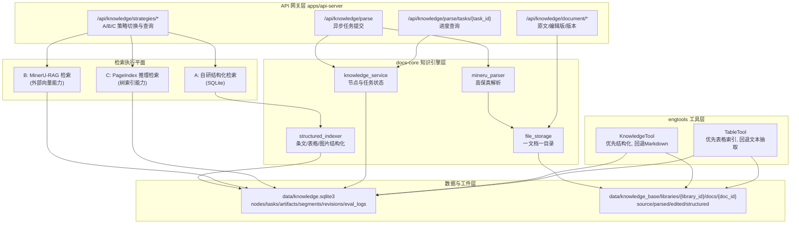
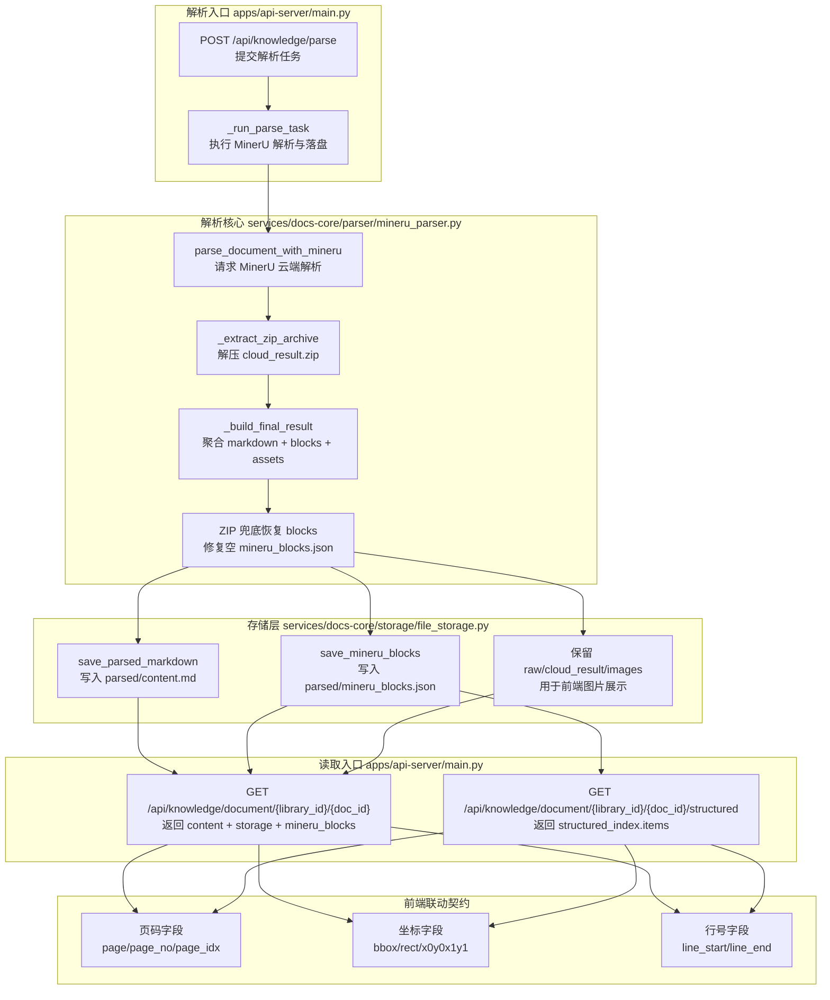

# AnGIneer 后端技术实现细节

本文档描述文档解析与对比查改能力的后端改造方案，聚焦 API 网关、docs-core、engtools 三层联动。

---

## 后端常用命令（自动同步）

<!-- AUTO_SYNC:SERVICES_TECH_COMMANDS:START -->
```bash
pnpm install
pnpm dev:backend
pnpm harness
pnpm harness:workflow
pnpm harness:tooling
pnpm docs:sync
pnpm docs:check
```
<!-- AUTO_SYNC:SERVICES_TECH_COMMANDS:END -->

---

## 后端架构图（文档解析改造版）



---

## PDF 对比高亮逻辑架构（后端）



---

## 一文档一目录规范

```text
data/knowledge_base/libraries/{library_id}/docs/{doc_id}/
├─ source/
│  └─ {original_filename}
├─ parsed/
│  ├─ full.md
│  └─ assets/
├─ edited/
│  ├─ current.md
│  └─ revisions/{timestamp}.md
└─ structured/
   ├─ segments.json
   ├─ tables.json
   └─ images.json
```

---

## 可直接开工清单（后端文件级）

- `apps/api-server/main.py`
  - 解析接口改异步任务化，返回 `task_id`。
  - 增加任务进度查询、文档版本、策略切换与统一查询接口。
  - 三策略索引构建改为路由分发，实际实现下沉到 `docs_core.storage.*_strategy`。
- `services/docs-core/src/docs_core/storage/structured_strategy.py`
  - A 策略结构化索引提取与入库实现。
- `services/docs-core/src/docs_core/storage/mineru_rag_strategy.py`
  - B 策略（MinerU-RAG）索引构建与向量能力接入实现。
- `services/docs-core/src/docs_core/storage/pageindex_strategy.py`
  - C 策略（PageIndex）索引构建实现。
- `services/docs-core/src/docs_core/api/knowledge_api.py`
  - 扩展 `nodes` 字段，新增 `parse_tasks`、`document_artifacts`、`document_segments`、`document_tables`、`document_images`、`document_revisions`、`strategy_eval_logs` 表。
- `services/docs-core/src/docs_core/storage/file_storage.py`
  - 实现一文档一目录读写 API，保留旧路径兼容读取。
- `services/docs-core/src/docs_core/parser/mineru_parser.py`
  - 输出解析产物清单并支持阶段进度回调。
- `services/engtools/src/engtools/config.py`
  - 统一知识目录解析，支持新旧结构双栈。
- `services/engtools/src/engtools/KnowledgeTool.py`
  - 优先读取结构化片段，回退 Markdown 检索。
- `services/engtools/src/engtools/TableTool.py`
  - 优先读取结构化表格索引，回退 Markdown 表格解析。

---

## 三策略执行说明

- A（自研结构化）作为默认生产策略，检索路径最可控、可审计。
- B（MinerU-RAG）保留为对照策略，复用其检索能力并统一写评测日志。
- C（PageIndex）作为长文档推理检索增强策略，统一回传证据路径与耗时。
- 三策略统一写入 `strategy_eval_logs`，前端按文档与问题维度做横向比对。

---

## 生产级解析与匹配优化 (2025-03)

针对复杂文档（如含嵌套列表、公式、表格），后端实施了以下关键优化以确保 95%+ 的匹配率：

### 1. Mineru Blocks 文本清洗与提取
- **List Item 递归提取**：修复了 `mineru_parser.py` 中无法提取嵌套 `list_items` 文本的问题，确保 `6.1.1` 等条款内容完整保留。
- **Cleaned Text Mirror**：在内存中构建仅包含中文、字母、数字的文本镜像（移除标点符号和空白），解决 OCR 导致的标点差异（如 `.` vs `．`）引起的匹配失败。

### 2. 结构化匹配算法优化 (StructuredStrategy)

### 3. MinerU Block 生成算法 (A/B/C 融合) - 2026-03 新增

为解决单一来源信息不全的问题，后端采用多源融合算法生成最终的 `mineru_blocks.json`：

1.  **数据源定义**：
    *   **Source A (`model.json`)**: 核心内容源。提供全文文本、段落结构、基础 bbox。
    *   **Source B (`layout.json`)**: 视觉布局源。提供页面尺寸 (`width`, `height`)、图片/表格的精确裁剪坐标。
    *   **Source C (`content_list_v2.json`)**: 逻辑目录源。提供文档的层级大纲（目录树）。

2.  **融合流程**：
    *   **Step 1**: 读取 Source B 获取每一页的 `width` 和 `height`，初始化页面坐标系。
    *   **Step 2**: 遍历 Source A 提取所有 `blocks`。
        *   对每个 block，优先使用 Source A 的文本。
        *   如果 block 是图片/表格，尝试在 Source B 中找到对应位置更精确的截图坐标。
    *   **Step 3**: 遍历 Source C 构建层级索引 (Level Hierarchy)。
        *   将目录树节点映射到具体的 Block ID。
        *   为 Block 添加 `level` 属性 (如 `H1`, `H2` 等)。

3.  **层级定义 (Level Hierarchy)**：
    引入 `0/X/T/F/E` 标记体系：
    *   **0 (Root)**: 文档根节点。
    *   **X (Page)**: 物理页面节点。
    *   **T (Title)**: 标题节点 (来自 Source C 或 Source A 的 heading)。
    *   **F (Figure/Table)**: 图表节点 (需特别关注 bbox 精度)。
    *   **E (Element)**: 基础内容节点 (段落、列表项)。

4.  **验证标准**：
    *   所有 Block 必须包含 `bbox` (归一化或绝对坐标需统一)。
    *   所有 Block 必须包含 `page_idx`。
    *   目录节点必须能索引到具体的 Block。
- **双轮搜索策略**：
  1. **第一轮（局部）**：优先从上次匹配位置开始向后搜索，利用文档的自然顺序特性，大幅减少搜索空间。
  2. **第二轮（全局）**：若局部搜索失败，则从头开始全局搜索，确保不漏掉乱序内容。
- **序列游标 (Sequential Cursor)**：维护 `last_matched_idx`，使算法复杂度在理想情况下接近 O(N)。
- **模糊匹配增强**：采用“包含”与“被包含”的双向检测，并结合重叠率阈值。

### 3. 架构图示
详细的逻辑架构图请参考：[Architecture Diagrams](../docs/architecture_diagrams.md)

- Mineru Blocks 生成逻辑
- Mineru Blocks <-> 数据库映射
- PDF/Markdown 高亮及联动逻辑
