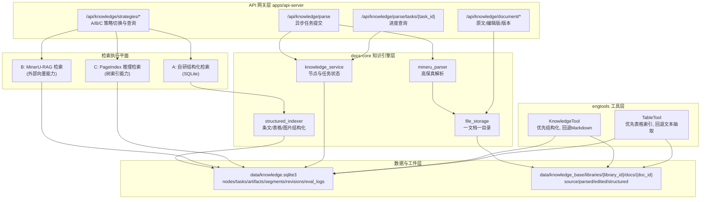

# AnGIneer 后端技术实现细节

本文档描述文档解析与对比查改能力的后端改造方案，聚焦 API 网关、docs-core、engtools 三层联动。

---

## 后端常用命令（自动同步）

<!-- AUTO_SYNC:SERVICES_TECH_COMMANDS:START -->
```bash
pnpm install
pnpm dev:backend
pnpm harness
pnpm harness:workflow
pnpm harness:tooling
pnpm docs:sync
pnpm docs:check
```
<!-- AUTO_SYNC:SERVICES_TECH_COMMANDS:END -->

---

## 后端架构图（文档解析改造版）



---

## 一文档一目录规范

```text
data/knowledge_base/libraries/{library_id}/docs/{doc_id}/
├─ source/
│  └─ {original_filename}
├─ parsed/
│  ├─ full.md
│  └─ assets/
├─ edited/
│  ├─ current.md
│  └─ revisions/{timestamp}.md
└─ structured/
   ├─ segments.json
   ├─ tables.json
   └─ images.json
```

---

## 可直接开工清单（后端文件级）

- `apps/api-server/main.py`
  - 解析接口改异步任务化，返回 `task_id`。
  - 增加任务进度查询、文档版本、策略切换与统一查询接口。
- `services/docs-core/src/docs_core/api/knowledge_api.py`
  - 扩展 `nodes` 字段，新增 `parse_tasks`、`document_artifacts`、`document_segments`、`document_tables`、`document_images`、`document_revisions`、`strategy_eval_logs` 表。
- `services/docs-core/src/docs_core/storage/file_storage.py`
  - 实现一文档一目录读写 API，保留旧路径兼容读取。
- `services/docs-core/src/docs_core/parser/mineru_parser.py`
  - 输出解析产物清单并支持阶段进度回调。
- `services/engtools/src/engtools/config.py`
  - 统一知识目录解析，支持新旧结构双栈。
- `services/engtools/src/engtools/KnowledgeTool.py`
  - 优先读取结构化片段，回退 Markdown 检索。
- `services/engtools/src/engtools/TableTool.py`
  - 优先读取结构化表格索引，回退 Markdown 表格解析。

---

## 三策略执行说明

- A（自研结构化）作为默认生产策略，检索路径最可控、可审计。
- B（MinerU-RAG）保留为对照策略，复用其检索能力并统一写评测日志。
- C（PageIndex）作为长文档推理检索增强策略，统一回传证据路径与耗时。
- 三策略统一写入 `strategy_eval_logs`，前端按文档与问题维度做横向比对。
